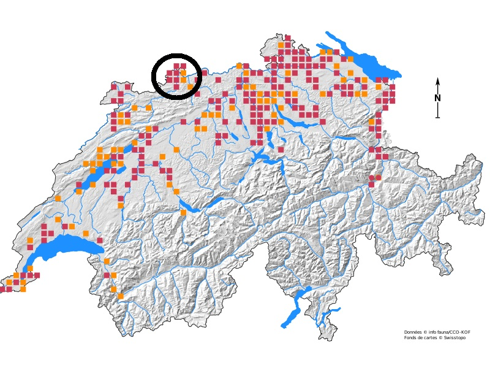

# Einleitung

Ein Grossteil der Amphibien in der Schweiz sind auf der roten Liste aufgeführt und können somit als gefährdet bezeichnet werden. Von den insgesamt 19 beurteilten Ambhibienarten sind 15 (78.9%) auf der Roten Liste aufgeführt [@schmidt2023roteliste]. Dies gilt auch für den Nördlichen Kammmolch (Triturus cristatus), welcher im selben Status bleibt wie in der letzten Fassung der Roten Liste [@schmidt2005rote]. Hauptursache für die Einstufung als stark gefährdet (Status EN) ist demnach das kleine Verbreitungsgebiet. Zudem wird angemerkt, dass in manchen Gebieten eine Gefährdung durch standortfremde Vorkommen des Italienischen Kammmolches (Triturus carnifex) bestehe.

Ursache für den generellen Gefährdungsstatus der Amphibien dürfte im Landschaftswandel liegen, welchem in den letzten Jahrzehnten viele Laichgewässer zum Opfer gefallen sind [@schmidt2015amphibien]. Die Amphibien sind auf die Vernetzung von Landlebensräumen mit Gewässern angewiesen, zudem müssen beide Lebensräume gewisse Bedingungen erfüllen. Für ein längerfristiges Überleben muss auch ein gelegentlicher Austausch mit anderen Populationen möglich sein. Die Ansprüche der Amphibien an ihren Lebensraum führt zu einer erhöhten Anfälligkeit auf Veränderungen in der Umwelt [@schmidt2015amphibien].

Eine weitere Gefährdungsursache, insbesondere für seltenen Arten, ist die Einschleppung von standortfremden Arten. @clavero2005invasive untersuchten Ursachen für das Aussterben von Tieren auf der roten Liste der internationalen Union zur Bewahrung der Natur (IUCN). Von den 680 untersuchten Tierarten konnten für 170 Gefährdungsursachen ermittelt werden.  Demnach sind die Ursachen für das Aussterben von 91 Arten (54%) zumindest teilweise und von 34 Arten (20%) ausschliesslich auf standortfremde Arten zurückzuführen. In einer zweiten Studie untersuchten @blackburn2019alien ebenfalls die Ursachen für das Aussterben von Arten auf der roten Liste der IUCN. Demnach wurde das Aussterben von 25.5% der Pflanzen- und 34.4% der Tierarten durch eingeschleppte Arten verursacht.

In der Gemeinde Allschwil, südlich von Basel, wurden in den 2000er Jahren Italienische Kammmolche (Triturus carnifex) entdeckt. Während der Italienische Kammmolch natürlicherweise nur auf der Alpensüdseite vorkommt, besiedelt der Nördliche Kammmolch (Triturus cristatus) weite Teile Europas nördlich der Alpen. Die Alpen wirken als natürliche Barriere. Die Vorkommen der südlichen Art auf der Alpennordseite sind in den meisten Fällen auf menschliche Einführung zurückzuführen, einzig in einer schmalen Kontaktzone östlich der Alpen besteht ein Gebiet mit natürlichem Aufeinandertreffen beider Arten [@meilink2015genetic]. In Bereichen mit eingeschleppten Italienischen Kammmolchen, wurde jeweils ein Rückgang des Nördlichen Kammmolches dokumentiert (Niederlande: @meilink2015genetic; Genf: @arntzen1999geneva). Beide Arten sind in der Schweiz heimisch und auf der Roten Liste der Schweiz als stark gefährdet eingestuft [@schmidt2005rote]. In der Region Basel befindet sich eine Population an Nördlichen Kammmolchen, die Verbreitungskarte ist in Abbildung \@ref(fig:tritcristKarte) dargestellt. Diese Art wird hier mit Investitionen in die Naturschutzgebiete gezielt gestützt wird ([Entscheid zur Unterschutzstellung der Zeigelei Oberwil](https://www.lze-daten.bl.ch/nldaten/geschuetzte_naturobjekte/rrb_rvo/199_RRB_Ziegelei%20Oberwil.pdf)).

```{r 'tritcristKarte',echo=FALSE,fig.cap="Verbreitung des Nördlichen Kammmolches gemäss des Schweizerischen Informationszentrums für die Fauna. Schwarz eingekreist ist die Region Basel und die Vorkommen des Nördlichen Kammmolchs", out.width='60%'}

```

Das Auftreten des Italienischen Kammmolches in der Region Basel stellt also eine bedeutende Gefährdung für die Population der Nördlichen Kammmolche dar. Um die Nördlichen Kammmolche (und die getätigten Investitionen) zu schützen, werden die Italienischen Kammmolche gezielt bekämpft. Ziel dieser Massnahmen ist, die standortfremde Art wieder komplett aus der Natur zu entfernen und somit eine potentielle Gefährdungsursache für die seltenen Nördlichen Kammmolche zu eliminieren. Es ist nicht absehbar ob und wie die ergriffenen Bekämpfungsmassnahmen wirken. 

Um die Bekämpfungsmassnahmen gezielt zu entwickeln und die Erfolgsaussichten der Massnahmen abschätzen zu können sind Kenntnisse der Populationsdynamik hilfreich. Die Populationsdynamik beschreibt Faktoren wie Populationsgrösse, Ausbreitungsverhalten, Fortpflanzung und Sterblichkeit und bringt diese in einen Zusammenhang. Für solche Untersuchungen werden häufig statistische oder mathematische Modelle verwendet (z.B: @caudera2021mathematical, @la2017understanding). @vimercati2021cost zeigt an einem Beispiel in Südafrika auf, wie Populationsmodelle die gezielte Bekämpfung von invasiven Amphibien und den Einsatz der finanziellen Mittel verbessern können. Diese Modelle lassen grundsätzlich Aussagen auf Systemebene zu. @vimercati2017integrating ergänzen bestehende mathematische Modelle um den Landschaftswiderstand um die effektive Ausbreitung in einer konkreten räumlichen Umgebung zu simulieren. Dennoch bleiben räumliche Ausprägungen in dem Modellen nur marginal berücksichtigt. Aspekte wie Wanderhindernisse und Vernetzungskorridore können die Populationsdynamik entscheidend beeinflussen. Mittels agentenbasierten Methoden, lassen sich konkrete räumliche Beziehungen darstellen [@della2014simulating]

Agentenbasierte Modellierungsansätze bieten Möglichkeiten um die Modelle mit räumlichen Gegebenheiten und einer vielzahl von Verhaltensweisen und -Regeln zu ergänzen [@deangelis2014individual]. So entstehen Modelle, welche die Entscheidungsstrukturen in biologischen Systemen nachbilden, vor allem wenn sie mit stochastischen Elementen ergänzt werden. Dabei können überraschende Muster entstehen (genannt "Emergenz"), welche durch formelbasierte Ansätze nicht replizierbar sind.

Das vorliegende Modell hat zum Ziel die Dynamik der Population von Italienischen Kammmolchen im Mühlebachtal nachzubilden und die Wirksamkeit der Bekämpfungsmassnahmen zu überprüfen. Das Modell ist auf dem Github-Repo [phfranke/masterarbeit](https://github.com/phfranke/masterarbeit) verfügbar.


## Fragestellung {#fragestellung}
### Forschungsfrage
Untersuchung der Populationsdynamik des Italienischen Kammmolchs (Triturus carnifex) im Mühlebachtal in Allschwil anhand agentenbasierter Modellierung und Abschätzung der Erfolgsaussichten der bestehenden Bekämpfungsstrategie.

### operative Teilziele
- Erstellen des Modells
- Kalibrieren des Modells anhand der erhobenen Daten
- Untersuchen der Populationsentwicklung bis zum Jahre 2050
- Validieren des Modells


