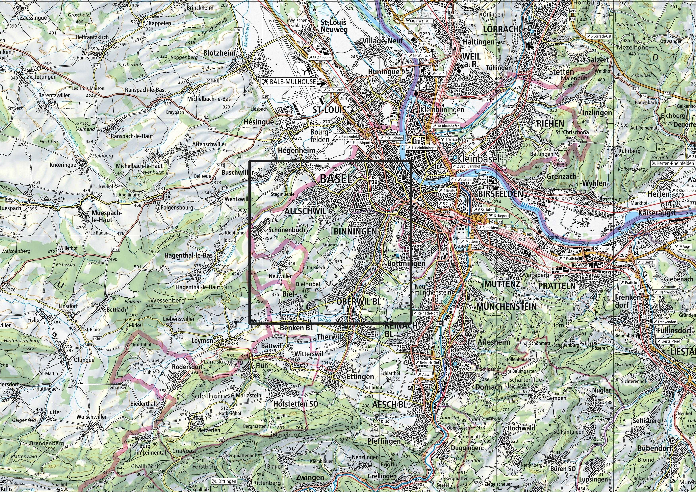
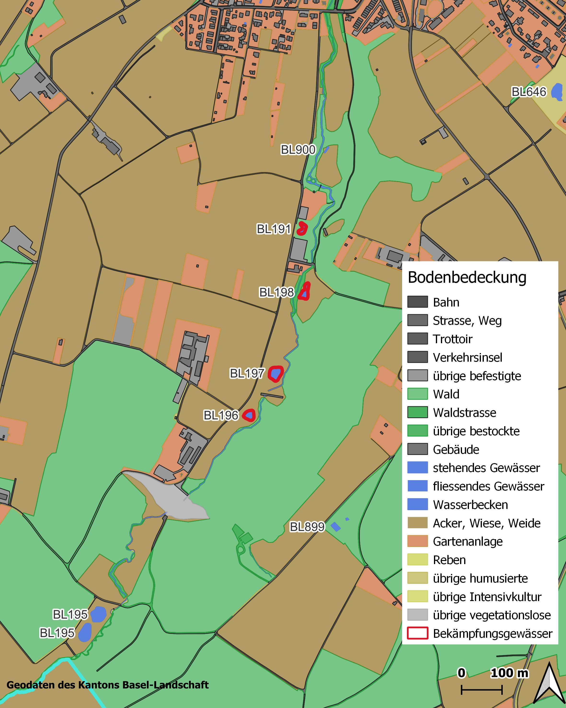
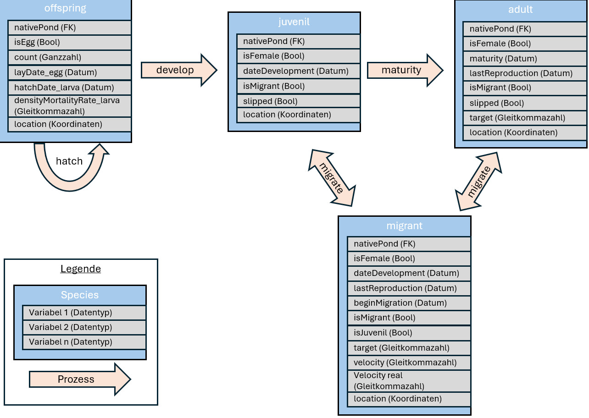
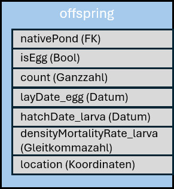
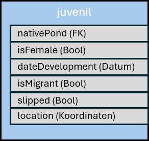
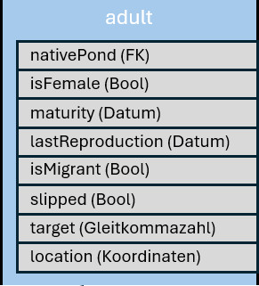
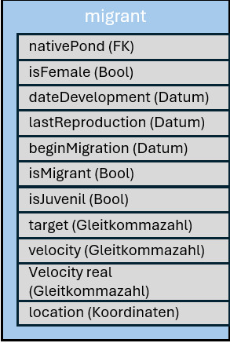
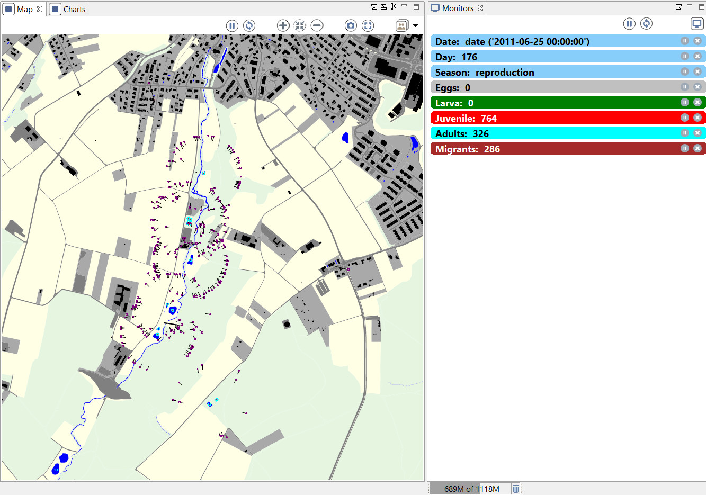
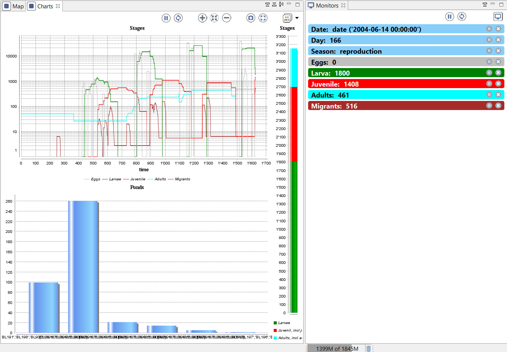
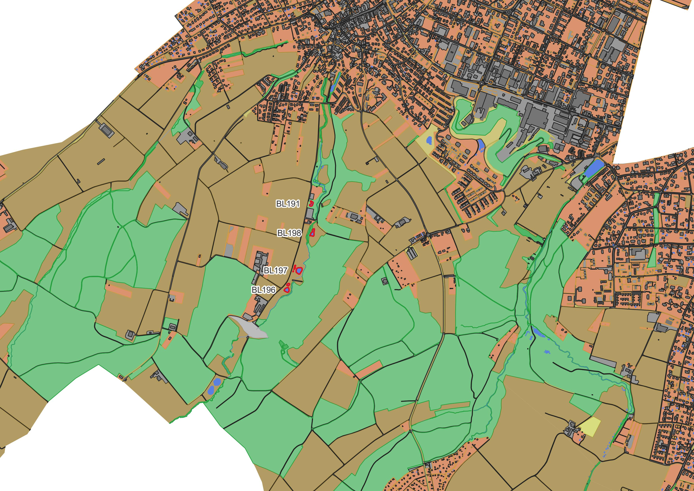

# Material und Methoden


## Untersuchungsgebiet {#untersuchungsgebiet}
Das Untersuchungsgebiet besteht aus einem `8 * 8` km grossen Quadrat in der Nordwestecke der Schweiz. Es erstreckt sich bis zur Kantonsgrenze zu Basel-Stadt im Norden sowie zur Landesgrenze zu Frankreich im Westen. Es deckt auf Schweizer Seite die Gemeinden Allschwil, Bottmingen, Schönenbuch und Oberwil komplett ab und die Gemeinden Biel-Benken, Binningen und Reinach teilweise. Die Lage des Untersuchungsgebietes ist auf der Übersichtkarte in Abbildung \@ref(fig:uebersichtskarte) schwarz umrandet. Die Gebiete ausserhalb des Kantons Basel-Landschaft werden grösstenteils ausgeschlossen. Sie liegen peripher und spielen für den Untersuchungszweck eine untergeordnete Rolle. Ausnahme ist die Gemeinde Neuwiller in Frankreich (rot umrandet auf der Übersichtskarte). Diese liegt zwischen den Gemeinden Allschwil und Biel-Benken und könnte möglicherweise durch wandernde Kammmolche erreicht werden. Das Ausschliessen dieser Gemeinde würde die Aussagekraft des Modells einschränken. Aus diesem Grund wurde diese Gemeinde in das Modell integriert.

```{r 'uebersichtskarte',echo=FALSE,out.width="100%",fig.cap="Das Untersuchungsgebiet (schwarz umrandet) auf der Landeskarte im Massstab 1:100'000"}

```
Die tatsächlich beobachteten Vorkommen der Kammmolche sind isoliert im Mühlebachtal in Allschwil (blaues Rechteck in Abbildung \@ref(fig:uebersichtskarte)) und umfassen wenige Gewässer. Das Untersuchungsgebiet wurde bewusst grosszügig gewählt, um zu verhindern, dass die Agenten an die Ränder stossen und so möglicherweise die Aussagekraft des Modells beeinträchtigen.

## Biologie Italienischer Kammmolch (Triturus carnifex)
Für die Erstellung des Modells sind tiefergehende Kenntnisse der Biologie notwendig. Hier werden wesentliche Aspekte der Biologie von Kammmolchen zusammengefasst. Die Lebensweisen von Italienischem Kammmolch (Triturus carnifex) und Nördlichem Kammmolch (Triturus cristatus) ähneln sich zuweilen stark, andere Aspekte sind nur von einer Art detailliert bekannt. Für die vorliegende Arbeit werden wissenschaftliche Erkenntnisse von beiden Arten meist als gleichbedeutend aufgefasst.

### Jahreszyklus
Kammmolche folgen, wie die meisten Amphibien, einem ausgeprägten jahreszeitlichen Ablauf. Adulte Tiere verbringen grosse Teile des Jahres an Land und wandern im Vorfrühling in die Gewässer ein. Dort findet die Paarung und die Laichablage statt. Dabei legt das Weibchen `200` bis `400` Eier ab [@jehle2011crested] und tarnt jedes Ei einzeln mit einem Blatt [@meyer2009schlangenspuren]. Vermutlich ist diese intensive Laichpflege der Grund, warum Weibchen nach dem Laichen mehrjährige Pausen einlegen [@schwizer2007population]. In diesen Pausen bleiben sie auch zur Laichzeit den Gewässern fern.
Nach der Fortpflanzung verlassen die Tiere die Gewässer und verbringen den Rest des Jahres in den Landlebensräumen. Diese befinden sich meist in unmittelbarer Umgebung zu den Gewässern, selten bis zu wenigen hundert Metern entfernt [@stoefer2001zeitliche].

### Wanderungen {#introWanderungen}
Beide hier behandelten Kammmolch-Arten sind sehr gewässertreu (z.B. @jehle2007wanderleistung, @mori2017twenty). Sie begeben sich für die Fortpflanzung in dasjenige Gewässer, in welchem sie selber geschlüpft sind. Der kleinere Teil der Individuen wandert über weitere Distanzen und wechselt das bevorzugte Laichgewässer. Gemäss @kupfer2000population wurden einer von 83 aulten Kammmolchen und 13 von 35 Juvenilen in einem anderen Gewässer gefunden, als sie selber geschlüpft sind. Die Wanderungen beginnen nach der Fortpflanzung. Die Wandergeschwindigkeit ist bei juvenilen Kammmolche etwas höher (500m gemäss @kupfer1998wanderstrecken) als bei adulten Individuen (293m gemäss @stoefer2001zeitliche). Gemäss @jehle2007wanderleistung konnte zudem mittels genetischen Methoden nachgewiesen werden, dass nur sehr wenige Individuen (ca. 1 pro Jahr und Population) mit sehr grosser Wanderleistung (etwa das vierfache des Normalen) für die Verbindung zu entfernten Populationen verantwortlich sind. Mehrere Sinne sind an der Orientierung beteiligt. Die geruchliche Wahrnehmung wird dabei als wichtiger Sinn erachtet, auch für die Orientierung über grössere Distanzen [@weiss2021olfaction].

### Entwicklungsstadien
Die Weibchen legen 200-400 Eier [@meyer2009schlangenspuren]. Aufgrund eines genetischen Phänomens stoppt bei der Hälfte der Eier die Entwicklung und die Embryonen sterben ab. Grund dafür sind zwei unterschiedliche Ausprägungen des Chromosoms 1. Embryonen, welche zwei gleichartige Chomosomen 1 besitzen, sterben demnach ab und Individuen mit beiden unterschiedlichen Ausprägungen sind überlebensfähig [@horner1985normal]. Die Mortalität der geschlüpften Larven ist ebenfalls relativ hoch, lediglich ungefähr `5%` der Larven erreichen die Metamorphose [@laufer2007amphibien]. Vieles spricht dafür, dass die Sterblichkeit in der Larvalphase  abhängig ist von der Larvendichte (persönliche Informationen B. Schmidt, @van2007body, @schabetsberger1995alpine). Insbesondere der hohe Energiebedarf der Larven dürfte zu einem starken Konkurrenzdruck bei der Nahrungsbeschaffung führen. Die Larven sind ans Gewässer gebunden, erst nach der Metamorphose erhalten sie die Gestalt der ausgewachsenen Kammmolche und damit die Fähigkeit, sich an Land zu bewegen. Sie sind aber noch nicht geschlechtsreif. Dieses Jugendstadium wird hier als "juvenil" bezeichnet. Nach zwei bis vier Jahren erreichen die Tiere die Geschlechtsreife und somit das adult-Stadium. 


## Bekämpfungsprojekt
Das Bekämpfungsprojekt im Mühlebachtal hat zum Ziel, die standortfremden Italienischen Kammmolche komplett aus dem Lebensraum zu entfernen. Die Gewässer wurden von Experten und mit genetischen Methoden untersucht. Es zeigte sich, dass nur in wenigen Gewässern Italienische Kammmolche vorkommen. Diese sind in der Abbildung \@ref(fig:bekGew) rot umrandet. Für die Bekämpfung werden diese Gewässer jeweils Anfang Jahr mit einem Amphibienzaun abgeriegelt. Die Zäune sind lückenlos und im Boden eingegraben, um das Durchschlüpfen von Kammmolchen möglichst zu verhindern. Entlang der Zäune sind in regelmässigen Abständen Eimer im Boden eingegraben. Alle Amphibien, welche für die Laichablage in die Gewässer einwandern, werden in einen der Eimer geleitet. Die Eimer werden regelmässig kontrolliert und die darin befindlichen Tiere bestimmt. Die Kammmolche werden aussortiert und alle anderen Amphibien über die Zäune gehoben und frei gelassen. Die Kammmolche werden anschliessend auf Alter und Geschlecht bestimmt und gewogen. Diese erhobenen Daten aus den Jahren 2021 und 2022 stehen für diese Arbeit zur Verfügung (siehe Kapitel \@ref(daten)) und werden für die Kalibrierung und Validierung verwendet.

```{r bekGew,echo=FALSE,out.width="70%",fig.cap="Übersichtskarte über das Mühlebachtal. Rot umrandet sind die Gewässer, an welchen Kammmolche bekämpft werden."}

```


## Modellbeschreibung

Die Struktur dieses Kapitels folgt dem ODD-Protokoll wie von @grimm2006standard vorgeschlagen und später in @grimm2010odd erweitert. Die Bezeichnungen von Parametern und Variablen hier entsprechen denjenigen im Modell und sind deshalb auf englisch.

### Zweck
Das Modell stellt die Entwicklung der Kammmolchpopulation im Mühlebachtal nach. Sowohl die räumliche Ausbreitung der Population als auch die anzahlmässige Entwicklung der einzelnen Stadien werden berechnet. Ab dem Jahr 2021 werden im Mühlebachtal jährlich Bekämpfungsmassnahmen umgesetzt. Diese sind im Modell ebenfalls ab diesem Zeitpunkt implementiert. Mit dem Modell kann nachvollzogen werden wie sich die Population entwickelt und wie und ob die Bekämpfungsmassnahmen wirken.

### Räumliche und Zeitliche Auflösung
Das Modell arbeitet mit Vektordaten und verfügt somit nicht über eine definierte, räumliche Auflösung. Das Untersuchungsgebiet ist 8 x 8km gross und deckt die bekannten Vorkommen der Italienischen Kammmolche grosszügig ab. Details zum Untersuchungsgebiet siehe Kapitel \@ref(untersuchungsgebiet).
Die zeitliche Auflösung beträgt einen Tag. Das heisst,  jeder Zeitschritt im Modell entspricht einen Tag im Leben der Kammmmolche. Als Startzeitpunkt wird derjenige Moment angenommen, an dem die Kammmolche ausgesetzt wurden. Der Moment der mutmasslichen Freisetzung wird in den frühen 2000er Jahren angenommen. Das Startdatum wird auf den 1.1.2000 festgelegt. Als Enddatum ist der 31.12.2049. festgelegt.

### Agenten {#oddAgenten}

Das Modell bildet die Stadien nach, wie sie Kammmolche während ihrer Entwicklung durchleben. Im Modell werden für diese Stadien drei Spezien angelegt, eine weitere Spezies wird für die Wanderungen benötigt. In der Grafik in Abbildung \@ref(fig:grafik-spezies) sind diese Spezien, ihre Variablen und die Prozesse abgebildet. Es handelt sich um eine vereinfachte Darstellung, welche in den nächsten Abschnitten näher beschrieben wird.

``` {r grafik-spezies, out.with="120%", fig.cap="Vereinfachte, grafische Darstellung der im Modell angelegten Spezien und Prozesse"}

```

Die Stadien `juvenil` und `adult` erhalten eigene Spezien, die Stadien `egg` und `larva` hingegen werden im Superspezies `offspring` zusammengefasst. Die Spezies `migrant` dient der Modellierung der Wanderbewegungen und kann Agenten der Spezien `juvenil` und `adult` aufnehmen. Zwei weitere, hier nicht abgebildete Spezien werden im Modell für die Modellierung der Umwelt verwendet. `groundCover` ist für die Darstellung der Bodenbedeckung zuständig und dient der Berechnung von Wanderhindernissen, `pond` enthält sämtliche potentiellen Laichgewässer. Der Übergang zwischen den Stadien ist in Kapitel \@ref(prozess) detailliert beschrieben.


### Modellvariablen

Das Modell beinhaltet zahlreiche Variablen, welche für die Steuerung der Prozesse, die Orchestrierung der Agenten und für die Auswertung der Resultate benötigt werden. Es wird unterschieden zwischen globalen Variablen, welche auf Ebene des Modells festgelegt werden, und Variablen der einzelnen Spezien.

Diese Variablen bilden die eigentliche Aussage des Modells und zeigen wie viele Kammmolche in welchem Stadium zu jedem Zeitschritt vorhanden sind und in welchem Gewässer sie sich befinden. Zudem werden die Anzahl Tiere der einzelnen Stadien über den gesamten Zeitraum aufsummiert um einen Überblick über die Nachwuchs- und Sterblichkeitsraten zu erhalten. Weitere Variablen dienen der Steuerung der Agenten und transportieren wesentliche Informationen beim Übgergang der einzelnen Stadien. In den folgenden Kapiteln sind die Variablen aufgelistet, in Klammern ist jeweils der Datentyp angegeben.

#### Globale Variablen

Die globalen Variablen steuern die Modell-Zeit und aggregieren Zahlen aus den Spezien um Auswertungen vornehmen zu können.

- Zeitmanagement:
  - `starting_date` (Datum)
  - `end_date` (Datum)
  - `step` (Sekunden)
  - `seasons` (Schlüssel-Wert-Paar)
  - `seasonNow` (Ganzzahl)
  - `current_date` (Datum)
- Anzahl Tiere, über den ganzen Zeitraum aggregiert:
  - `eggs_tot` (Ganzzahl)
  - `larva_tot` (Ganzzahl)
  - `juv_tot` (Ganzzahl)
  - `adult_tot` (Ganzzahl)
  - `migrantJuv_tot` (Ganzzahl)
  - `migrantAdult_tot` (Ganzzahl)
  - `catched_adult_tot` (Ganzzahl)
  - `catched_juvenil_tot` (Ganzzahl)
- Berechnung der besetzten Gewässer:
  - `occupiedPonds_list`(Liste)
  - `occupiedPonds_count` (Ganzzahl)

#### Variablen pro Spezies
Die Struktur der Variablen ähnelt sich in den Spezien. Es gibt in jeder Spezien eine Datumsvariable, welche das Datum enthält, an welchen der Agenten geschaffen wurde. Die Variable `nativePond` enthält einen  Verweis auf das angestammte Gewässer und ist ein Fremdschlüssel auf die Spezies `pond`. Dadurch kann direkt von einem Individum auf Variablen seines Laichgewässers zugegriffen werden. Das Geschlecht des Agenten wird durch `isFemale` gespeichert. Weitere Variablen werden für die Steuerung von Prozessen benötigt. `location` wiederum enthält die Koordinaten des aktuellen Aufenthaltsortes. Bei Variablen, welche nur zwei unterschiedliche Werte annehmen können, wird jeweils ein Boolscher Datentyp (`true`/`false`) verwendet. Dies vereinfacht die Filterung der entsprechenden Individuen, ist einfacher zu prozessieren und weniger fehleranfällig. Die Bezeichnung der betreffenden Variablen, zeigt welche Bedeutung die Variable annimmt, wenn sie `true` enthält. Der andere mögliche Wert wird demnach durch `false` repräsentiert. Dies betrifft die Variablen `isEgg` (`true`=Stadium Ei, `false`=Stadium Larve), `isJuvenil` (`true`=Stadium Juvenil, `false`=Stadium Adult), `isFemale` (`true`=weiblich, `false`=männlich) und `slipped` (`true`=entwischt `false`=gefangen).

Hier eine Übersicht über alle Variablen:

 [Spezies `groundCover`]{.ul}
 
  - `type` (Text)
  
 [Spezies `pond`]{.ul}
 
  - `placeOfExposion` (Bool)
  - `catchingNet` (Bool)
  - `pondNumber` (Text)
  - `area` (Gleitkommeazahl)
  - `newtCount` (Ganzzahl)
  - `larvaCount` (Ganzzahl)
  - `densityLarva` (Gleitkommazahl)
  
 [Spezies `offspring`]{.ul} 

  - `nativePond` (FK)
  - `isEgg` (Bool)
  - `count` (Ganzzahl)
  - `layDate_egg` (Datum)
  - `hatchDate_larva` (Datum)
  - `densityMortalityRate_larva` (Gleitkommazahl)
  - `location` (Koordinaten)
  
<!--  -->
  
 [Spezies  `juvenil`]{.ul}
 
  - `nativePond` (FK)
  - `isFemale` (Bool)
  - `dateDevelopmen` (Bool)
  - `isMigrant` (Bool)
  - `slipped` (Bool)
  - `location` (Koordinaten)
 
<!--  -->

 [Spezies  `adult`]{.ul}
 
  - `nativePond` (FK)
  - `isFemale` (Bool)
  - `maturity` (Bool)
  - `lastReproduction` (Datum)
  - `isMigrant` (Bool)
  - `slipped` (Bool)
  - `target`(Bool)
  - `location` (Koordinaten)
 
<!--  -->
  
 [Spezies  `migrant`]{.ul}
  
  - `nativePond` (FK)
  - `isFemale` (Bool)
  - `dateDevelopment` (Bool)
  - `lastReproduction` (Datum)
  - `beginMigration` (Datum)
  - `isMigrant` (Bool)
  - `isJuvenil` (Bool)
  - `target` (Bool)
  - `velocity` (Gleitkommazahl)
  - `velocity_real` (Gleitkommazahl)
  - `location` (Koordinaten)
 
<!--  -->


### Prozesse {#prozess}

In Abbildung \@ref(fig:grafik-spezies) sind die Prozesse abgebildet, welche für den Übergang zwischen den Stadien benötigt werden. Diese Prozesse berechnen eine Sterblichkeit, kreieren Agenten, vererben Variablen und löschen Agenten. Weitere Prozesse beschreiben die Wanderungen, die Fortpflanzung und die Sterblichkeit von Larven und Adulten. Die einzelnen Prozesse werden in den nächsten Kapiteln detaillierter beschrieben. Einzelne Funktionalitäten werden in Pseudocode beschrieben, damit lässt sich die technische Funktionsweise nachvollziehen ohne den Syntax der hier verwendeten Software kennen zu müssen. Beim Übergang von einer Spezies in die andere, werden auch immer Variablen vererbt. Dies ist bei den entsprechenden Variablen in den Prozessbeschrieben vermerkt.


#### Formelbasierte Simulationen, Spezies `offspring`

Die ersten Stadien (Eier und Larven) sind an die Gewässer gebunden, umfassen sehr viele Individuen und sind von kurzer Lebensdauer. Sie unternehmen keine Wanderungen und interagieren nicht wesentlich mit anderen Individuen. Im Modell erhalten sie die Aufgaben, die Entwicklungsdauer und die natürliche Sterblichkeit nachzubilden. Da die Tiere keine räumlichen Interaktionen eingehen, ist es nicht nötig diese als eigenständige Individuen zu modellieren. Wie in @WALLENTIN2017165 beschrieben, kann das Verhalten von vielen Individuen mit einer geringen räumlichen Verbreitung durch formelbasierte Ansätze adäquat und effizient modelliert werden. Diesem Ansatz folgend, bildet das Modell die ersten beiden Stadien (Eier und Larven) nicht als einzelne Individuen ab, sondern in einer Nachwuchs-Einheit. Diese Einheit kann mit dem Begriff Schwarm versinnbildlicht werden und wird im Modell durch die Spezies `offspring` repräsentiert. Ein Agent dieser Spezies enthält alle Individuen aus einem einzelnen Eierlege-Ereignis. Die Anzahl Individuen pro Agent wird in der Variable `count` geführt. In der ganzen Lebensdauer der Agenten dieser Spezies werden zwei Arten von Sterblichkeit berechnet. Es handelt sich einerseits um die Sterberate der Eier, andererseits um die dichteabhängige Sterblichkeit im Larvenstadium. Details zur dichteabhängigen Sterblichkeit werden in den Kapiteln \@ref(dichtesterb) beschrieben. Beide Prozesse verändern mit Hilfe von Formeln die Variable `count`. Diese Prozesse werden in den nachfolgenden Kapiteln \@ref(hatch) und \@ref(dichtesterb) erläutert. 

#### Fortpflanzung und Eier legen {#reproduction}

Weibchen legen Eier in ihr angestammtes Gewässer, welche in der Variable `nativePond` gespeichert wird. Dies ist nicht jederzeit möglich. Es müssen eine Reihe von Bedingungen eintreffen, damit Eier abgelegt werden können:

- Die Jahreszeit: Fortpflanzung findet in einem festgelegten Zeitraum statt.
- Es muss mindestens ein Männchen im gleichen Gewässer vorhanden sein wie das Weibchen.
- Das Weibchen befindet sich nicht in der Fortpflanzungspause. Die Pause wird durch die Variable `lastReproduction` und dem Parameter `reproductionBreak` definiert.

Beim Eierlegen wird ein Agent der Spezies `offspring` mit folgenden Variablen geschaffen:

- `isEgg` = `true`
- `count` = `parameter(clutchSize)`
- `nativePond` = Vererbung der Variablen `nativePond` der Mutter
- `layDate_egg` = `current_date`
- `location` = Vererbung der Variablen `location` der Mutter

#### Schlüpfen {#hatch}

Der Übergang zwischen dem Stadium Ei und Larve erfolgt beim Schlüpfen. Nur `50%` der Eier erreichen das Larvenstadium. Diese natürliche Sterblichkeit wird hier in der Veränderung der Variable `count` angewendet. Der Übergang zwischen den Stadien wird durch die Veränderung der Variable `isEgg` von `true` auf `false` vollzogen. Der Zeitpunkt des Schlüpfens wird durch die Variable `layDate_egg` und den Parameter `maxAge_Egg` bestimmt. Es werden folgende drei Variablen in der Spezies `offspring` verändert:

- `count` = `count * parameter(survival_egg)`
- `isEgg` = `false`
- `hatchDate_larva` = `current_date`


#### Dichteabhängige Sterblichkeit der Larven {#dichtesterb}

Im Larvenstadium wird eine dichteabhängige Sterblichkeitsrate eingeführt. Die Annahme ist, dass mit zunehmender Dichte die Sterblichkeit exponentiell ansteigt. Bei unbedeutender Dichte besteht ebenfalls eine Sterblichkeit, verursacht durch Krankheiten, Fressfeinde und weitere Faktoren. Diese Grundsterblichkeit wird gestützt auf die Werte aus anderen Stadien  als `0.6` angenommen. Dies entspricht einer Überlebenswahrscheinlichkeit von `40%`. In der Grundformel $y=a*x^2 + b*x + c$ ist $y$ die Sterberate der Larven, $x$ ist die Larvendichte, $b$ wird auf 0 gesetzt, und $c$ entspricht der Grundsterblichkeit von `0.6`. Der Koeffizient $a$, welcher die Öffnung der Kurve und somit die Auswirkung der Dichte auf die Sterblichkeit bestimmt, wird im Kalibrationsprozess ermittelt (Kapitel \@ref(kalidichte)). Das Ergebnis beschreibt die Überlebenswahrscheinlichkeit der Larven über die ganze Lebensdauer. Es resultiert die Formel: 

\begin{equation}
{S = {Koeff}*{Dichte}^2+S_{grund}}
(\#eq:sterblarve)
\end{equation}

Es gilt:

- $S$=Sterblichkeit pro Tag
- $S_{grund}$ = Grundsterblichkeit
- ${Koeff}$ = Koeffizient
- ${Dichte}$ = aktuelle Larvendichte in $\frac{Anzahl}{m^2}$


Die Sterblichkeit wird nicht laufend angewendet, sondern beim Wechsel vom Stadium Larve in das Stadium Juvenil berechnet.

#### Entwicklung der Larven zu Juvenilen

Hier findet der Übergang vom formelbasierten zum individuenbasierten Paradigma statt. Beim Erreichen des nötigen Alters (Parameter `maxAge_larva`) wird für jede überlebende Larve (ausgedrückt durch die Variable `count`) ein Agent der Spezies Juvenil geschaffen. Wieviele Larven das nächste Stadium erreichen, wird über die dichteabhängige Sterblichkeitsrate bestimmt (siehe vorheriges Kapitel). Bei der Entwicklung zum Juvenilen werden eine Reihe Eigenschaften vom kreierenden Agenten (ursprünglich von der Mutter) übernommen. Das Geschlecht wird nach einem Zufallsmechanismus festgelegt. Der Prozess wird nur für Agenten angewendet, bei welchen die Variable `isEgg` gleich `false` aufweist. Die Variablen werden folgendermassen gesetzt:

- `nativePond` = Vererbung der Variablen `nativePond` des kreierenden Agenten
- `location` = Vererbung der Variablen `location` des kreierenden Agenten
- `if random(1.0) >= 0.5: isFemale=true, else: isFemale=false`
- `dateDevelopment` = `current_date`
- `isMigrant` = `true`, ansonsten würde die Entscheidung übersprungen, ob eine Wanderschaft angetreten wird oder nicht

Nach dem Übergang vom Larvenstadium ins juvenile Stadium, wird der kreierende Agent gelöscht.

#### Entwicklung vom Juvenilen zum Adulten

Der Übergang von den Juvenilen zum Adulten wird über den Kalender terminiert. Das Alter der Agenten wird mit dem aktuellen Modelldatum (`current_date`) und der Variable `dateDevelopment` ermittelt. Es erreichen nicht alle Agenten das nächste Stadium, ein Teil der Agenten stirbt. Die Sterblichkeit wird über einen Zufallsmechanismus anhand des Parameters `survival_juvenil` umgesetzt. Beim Erreichen des vorbestimmten Alters (in Parameter `maxAge_juv`), wird folgender Prozess ausgelöst: 

```
if random(1.0) >= survival_juvenil:
  create adult
do die
```

Der juvenile Agent wird in jedem Fall gelöscht. Mit der Zeile `if random(1.0) >= survival_juvenil` wir die natürliche Sterblichkeit simuliert. Für jeden Agenten wird einen Zufallszahl zwischen `0` und `1` generiert. Ist diese Zufallszahl höher als der Parameter `survival_juvenil`, wird ein Agent der Spezies `adult` kreiert. Die Variable `maturity` erhält das aktuelle Modelldatum und beschreibt den Tag des Erreichen der Geschlechtsreife. Die Attribute des neuen Agenten `adult` werden wie folgt gesetzt:

- `nativePond` = Vererbung der Variablen `nativePond` des kreierenden Agenten
- `location` = Vererbung der Variablen `location` des kreierenden Agenten
- `isFemale` = Vererbung der Variablen `isFemale` des kreierenden Agenten
- `maturity` = `current_date`

#### Jährliche Sterblichkeit der Adulten

Die Spezies `adult` verfügt als einzige Spezies über eine jährliche Sterblichkeitsrate. Diese wird einmal im Jahr berechnet. Als Zeitpunkt für diese Berechnung wird der letzte Tag des Jahres gewählt. Für jeden Agenten wird in einem Zufallsereignis entschieden, ob er überlebt. Der Zufallsmeachnismus ist ähnlich wie oben beschrieben: 

```
if random(1.0) <= survival_adult:
  do die
```


#### Wanderungen {#speciesMigrant}

Sowohl Adulte als auch Juvenile unternehmen Wanderungen. Im vorliegenden Modell werden Wanderungen als ein Wechsel des angestammten Laichgewässers aufgefasst. Saisonale Wanderungen, wie sie in der Natur jährlich vorkommen und im gleichen Gewässer enden wie sie starten, sind nicht Teil des Modells. Die wesentliche Funktion der Wanderungen im Modell ist die Ausbreitung der Population auf neue Gewässer. Die Wanderungen beginnen bei Adulten nach der Paarungszeit und bei Juvenilen sofort ab Erreichen des Stadiums. Für die Ausbreitungsleistung der Population sind zwei Faktoren verantwortlich: 1. Die Dauer der Wanderungen, 2. die Wandergeschwindigkeit. Die Wandergeschwindigkeit wird anhand der Literatur festgelegt und unterscheidet sich zwischen Juvenilen und Adulten. Die Wanderleistung beträgt hier `10m/Tag` für Adulte und `15m/Tag` für Juvenile  (Parameter `migration_velocity_adult` und `migration_velocity_juv`). Die Dauer der Wanderungen wird über eine Kalibration festgelegt. Diese dürfte sich aber im Bereich von `25` Tagen bewegen, um die belegten Ausbreitungsdistanzen von `293`m (adulte) und `500`m (juvenile) zu erreichen. Nähere Erläuterungen dazu im Kapitel \@ref(introWanderungen). Wenige Individuen verfügen jedoch über eine viel grössere Wanderleistung als die Anderen und vermögen so, weiter entfernte Gewässer zu besiedeln. Im Modell wird dies durch die Anpassung der Wandergeschwindigkeit erreicht. Einer von hundert Agenten der Species `migrant` verfügt über eine vierfache Wandergeschwindigkeit und erhält so die Möglichkeit, weit entfernte Gewässer zu besiedeln. Der Anteil der Population, welcher sich überhaupt auf Wanderschaft begibt, ist auf `12%` der Adulten und auf 37.3% der Juvenilen festgelegt (Parameter `migrationRate_adult` und `migrationRate_juv`). Die genannten Parameter geben dabei die Wahrscheinlichkeit an, dass ein Agent auf Wanderschaft geht. Diese Entscheidung findet nur einmal pro Stadium statt. Wenn das Los gegen eine Wanderung entscheidet, wird die Variable `isMigrant` auf `false` gesetzt, wodurch auch künftig keine Wanderungen unternommen werden können. Das gleiche geschieht nach einer abgeschlossenen Wanderung. Entscheided der Zufallsmechanismus, dass der Agent wandert, wird ein Agent der spezies `migrant` kreiert. Dabei werden sämtliche Variablen übergeben. Das Stadium, aus welchem der Wanderer stammt, wird in der Variable `isJuvenil` gespeichert (`true` für Juvenile, `false` für Adulte).

Die Wanderungen selber verlaufen bei beiden Spezies nach gleichem Muster:
Sie verlassen das Gewässer in einer zufälligen Himmelsrichtung. Bei jedem Schritt weichen sie zufällig `+/- 10°` vom Kurs ab. Die zurückgelegte Distanz wird durch die Parameter `migration_velocity_adult` und `migration_velocity_juv` bestimmt. Nach Ablauf der Wanderdauer (Parameter `migration_time`) wird das nächste Laichgewässer (Luftlinie) ermittelt und als neues angestammtes Gewässer hinterlegt (Variable `nativePond`). Danach führt die Wanderung direkt und ohne Kursabweichungen in das neu festgelegte Laichgewässer. Sobald der Agent innerhalb einer Tagesdistanz vom angezielten Gewässer ankommt, wird er gelöscht und ein Agent der entsprechenden Spezies (`juvenil` oder `adult`) im Gewässer geschaffen. Dabei werden sämtliche Variablen wieder übergeben.
Die Wanderung erfolgt unabhängig von der Umgebung, mit einer Ausnahme: Agenten können nicht durch Gebäude wandern. Details siehe Kapitel \@ref(sensing)


#### Bekämpfung
Ab dem Modelldatum 1.1.2021 werden Bekämpfungsmassnahmen simuliert. In der Realität werden Tiere bei der saisonalen Zuwanderung in die Gewässer mithilfe von installierten Zäunen gefangen. Kammmolche, welche in der Fortpflanzungspause sind, suchen keine Gewässer auf und können deshalb nicht gefangen werden. Im Modell werden diese saisonalen Wanderungen nicht simuliert. Deshalb werden nur Agenten gefangen, welche nicht in der Reproduktionspause sind und somit in die Gewässer wandern würden. Zudem werden nur an bestimmten Gewässern Zäune aufgestellt, diese sind in den Agenten der Spezies `pond` mit der Variable `catchingNet = true` markiert. Die zuwandernden Kammmolche erhalten eine Chance (Parameter `probabilityCatch`), durch die Zäune zu schlüpfen oder anderweitig nicht gefangen zu werden. Falls dies gelingt, wird die Variable `slipped` auf `true` gesetzt und die Tiere verbleiben bis zum Ende des Jahres ungefangen im Gewässer. Nachfolgend sind die Kriterien aufgelistet, nach welchen zu fangende Tiere selektiert werden:

- `nativePond.catchingNet == true`
- `lastReproduction + reproductionBreak >= current_date`
- `slipped == false`
- `random(1.0) < parameter(probalityCatch)`

Die Wahrscheinlichkeit, mit welcher ein Kammmolch in Realität gefangen wird, kann nicht eindeutig festgelegt werden, da dazu Zahlen fehlen. Deshalb werden drei Szenarien formuliert, anhand welcher Unsicherheiten bezüglich der Fangwahrscheinlichkeit getestet werden. Näheres dazu ist in Kapitel \@ref(szenarien) beschrieben. Die Szenarien bestimmen den Parameter `probabilityCatch`.


### Design Konzepte {#odd}
#### Grundlegende Prinzipien
Natürliche Abläufe weisen häufig kleinere oder grössere Schwankungsbereiche auf. Der Anteil an adulten Kammmolchen, welche auf Wanderschaft gehen, ist beispielsweise nicht exakt bekannt, sondern kann nur anhand von Studien auf einen Bereich eingegrenzt werden. In der Modellierung besteht jedoch die Gefahr, dass die Resultate chaotisch sind, also zwei Durchgänge des gleichen Modells total unterschiedliche Resultate liefern, was die Aussagekraft natürlich stark mindert. Gleichzeitig ist ein zu starres Verhalten des Modelles nicht erwünschenswert, da die Stärke von agentenbasierten Modellen darin liegt, unerwartete Verhaltensmuster zu offenbaren (Emergenz). Sowohl eine chaotische als auch ein absolut vorhersagbares Verhalten sind zu verhindern. Das Modell basiert auf einem starren Gerüst an fixen Parameterwerten, welche durch zufällige Ereignisse angereichert werden.

Grundlegendes Konzept des Modelles ist ein interner Kalender. Prozesse werden bei Erreichen eines gewissen Alters der Agenten oder bei Erreichen eines Modelldatums ausgelöst. Die zeitlichen Kriterien sind starr hinterlegt und weisen keine zufälligen Schwankungsbereiche auf. Zufällige Anteile sind in die Prozesse integriert, welche einen Anteil aller Agenten einer Spezies selektieren. Hier wird für jeden Agenten ein Zufallsprozess durchgeführt, welcher anhand einer Wahrscheinlichkeit entscheidet ob der Agent in den Prozess übergeben wird oder nicht. Die Wahrscheinlichkeiten sind dabei in Parametern abgelegt. Dies betrifft die meisten Sterblichkeiten und die Wanderungen.

Wie im Kapitel *Prozesse* (\@ref(prozess)) beschrieben, basiert der Grossteil auf einem agentenbasierten Paradigma. Entscheidungen, welche einen Agenten betreffen, werden dabei anhand einer Wahrscheinlichkeit berechnet und können nicht vorhergesagt werden. Ausnahme sind zwei immobilen Stadien mit grosser Anzahl Individuen. Hier wird ein formelbasierter Ansatz verfolgt.

#### Emergenz {#emergenz}
Die Emergenz ist eine Stärke der agentenbasierten Modellierung und beschreibt das Entstehen unerwarteter Muster. Diese ergeben sich durch das Zusammenspiel der individuellen Entscheidungen aller Agenten. Die Emergenz wird durch zufällige Ereigniss gefördert und durch festgelegte Regeln eher gebremst. Komplett starre Regeln werden immer zum gleichen Resultat führen. Allerdings führen zu viele zufällige Ereignisse zu chaotischem Verhalten und die Resultate mehrerer Durchgänge unterscheiden sich so stark, dass eine Kalibrierung des Modells oder die Interpretation der Resultate verunmöglicht wird. In diesem Modell werden deshalb so viele Parameter wie möglich auf einen Wert fixiert und nur gezielte zufällige Ereignisse eingesetzt. Das Modell verfügt über folgende Zufallsereignisse:

1. Selektieren eines bestimmten Anteils aller Agenten einer Spezies: Zufallsereignis, welches für jeden Agenten angewendet wird und entscheidet, ob der Agent selektiert wird oder nicht. Beim Übergang der Stadien werden auf diese Weise die Agenten selektiert, welche Sterben, welche auf Wanderschaft gehen und welche durch die Fangzäune schlüpfen.
2. Wanderrichtung: zufällige Wanderrichtung zu Beginn der Wanderschaft und Anpassunge der Wanderrichtung in jedem Schritt.
3. Wanderdistanz: Auswahl der Agenten, welche weiter Wandern als die anderen.

Die ersten beiden Punkte beinhalten nur ein geringes Potential zur Emergenz, da von diesen Entscheidungen meist sehr viele Agenten betroffen sind.  Die erste Methode führt dazu, dass am Ende der Anteil selektiert wird, welcher hier als Parameter eingespiesen wird. Das entspricht auf Modellebene nicht einem richtigen Zufallsereignis, sondern hat eher die Wirkung einer formelbasierten Modellierung. Bei einer Sterblichkeit von `60%` werden am Ende ungefähr `60%` der Agenten sterben. Die Schwankungen, welche in dieser Rate zu erwarten sind, führen selten zu unerwarteten Resultaten. Ebenso verhält es sich mit der Wanderrichtung. Je mehr Agenten auf Wanderschaft gehen, desto eher werden auch alle Himmelsrichtungen abgedeckt. Dieser Mechanismus führt zu einer gleichmässigen Verteilung der Wanderrichtungen und ist ebenfalls eher nicht für überraschende Resultate verantwortlich.
Anders die Wanderdistanz. Durch die zufällige Auswahl von wenigen Agenten, welche über eine vergrösserte Wanderdistanz verfügen, können durchaus Überraschungen erwartet werden. Die Weitwanderer besiedeln neue Gewässer. Wenn es gelingt, dass auf diese Weise mehrere geschlechtsreife, adulte Agenten unterschiedlichen Geschlechts in einem Gewässer aufeinandertreffen, kann eine neue Population gegründet werden. Da die Weitwanderer sehr selten sind, ist es nicht vorhersagbar ob und schon gar nicht in welchen Gewässern neue Populationen entstehen können. 

Die wesentlichen Kennzahlen der Verbreitung von Italienischen Kammmolchen im Projektgebiet sind die Anzahl Tiere sowie die besiedelten Gewässer. Das Verbreitungsgebiet wird durch die besiedelten Gewässer bestimmt. Zudem werden die Bekämpfungsmassnahmen bisher nur in wenigen Gewässern mit bekannten Vorkommen durchgeführt. Deshalb ist das Muster an besiedelten Gewässern in diesem Modell das entscheidende Merkmal. Würde die Emergenz in diesem Bereich fehlen, wäre sehr genau vorhersagbar, welche Gewässer besiedelt werden, was das natürliche Verhalten nicht adäquat nachbilden würde. In diesem Modell dürfte dieser Mechanismus für naturähnliche Resultate verantwortlich sein.


#### Sensing {#sensing}
Sensing beschreibt die Wahrnehmung der Umgebung durch Agenten. Darauf basierend können Entscheidungen oder Verhaltensmuster an die Umwelt angepasst werden. Dieses Modell beinhaltet einen Prozess, welcher auf der Wahrnehmung der Umgebung basiert: die Wanderung. Die Agenten bewegen sich dabei zum grossen Teil unabhängig von Ihrer Umgebung. Ausnahme sind die Wanderhindernisse. Gebäude können nicht durchschritten werden, sondern werden umgangen. Bei jedem Schritt auf der Wanderung wird die Linie vorausberechnet, auf welcher die Wanderung weiter verläuft. Kreuzt diese Linie ein Gebäude, wird die Wandergeschwindigkeit so angepasst, dass nur bis zum Gebäude hin gagangen werden kann. Danach ändert die Laufrichtung zufällig, bis das Gebäude umgangen ist oder die Wanderrichtung gänzliche angepasst wurde.


#### Stochastik
Das Modell basiert auf einer Mischung an stabilen Parametern und Zufallsereignissen. Die (stochastischen) Zufallsereignisse sind hauptsächlich dichothome Entscheidungen (`ja`/`nein`), welche für jeden Agenten entscheiden, ob ein bestimmtes Ereignis eintritt oder nicht. Beispiele dafür sind die Sterblichkeit und die Wandertätigkeit. Diese Entscheidungen werden in diesem Kapitel \@ref(emergenz) genauer beschrieben. Auf eine Wiederholung wird hier deshalb verzichtet.


#### Observation
Das Modell soll Resultate produzieren, welche uns jederzeit Aufschluss über die Populationsgrösse geben. Zu diesem Zweck enthält das Modell diverse Ausgabemöglichkeiten. In Anzeigen können tagesaktuelle Daten angezeigt werden. Dazu gehören das aktuelle Modelldatum, die aktuelle Anzahl Agenten in jedem Stadium sowie eine Karte, worauf der Standort der Agenten ersichtlich ist. Das entsprechende Interface des Gama-Models ist in Abbildung \@ref(fig:screenshot) ersichtlich. In der Karte sind nur die adulten Kammmolche und die wandernden Agenten dargestellt, da die Übersichtlichkeit sonst arg leidet. Die Wanderer sind zusätzlich mit einem Schwanz versehen, um die Wanderrichtung und -Geschwindigkeit anzuzeigen.

```{r screenshot,echo=FALSE,out.width="140%",fig.cap="Ein Screenshot auf das Interface des Gama- Modells"}

```

In einem zweiten Fenster ist anstatt der Karte ein Diagramm mit dem Verlauf der Kennzahlen vorhanden (siehe Abbildung \@ref(fig:screenshotDiagramm)). Hier werden in jedem Zeitschritt die aktuelle Anzahl der Agenten in allen Stadien aufgetragen und als Linie dargestellt. Weitere nützliche Information ist die Anzahl besiedelter Gewässer, welche hier als Balkendiagramm dargestellt ist. Die Höhe der Balken zeigt dabei die Anzahl adulter Kammmolche in diesen Gewässern. 

```{r screenshotDiagramm,echo=FALSE,out.width="140%",fig.cap="Ansicht der Diagramme im Gama-Modell"}

```


Diese Anzeigen sind aber für die Generierung von Resulaten und für Auswertungen nahezu nutzlos. Sie dienen zur Veranschaulichung, der Untersuchung des Modellverhaltens und zur Fehlersuche. Um Auswertungen vornehmen zu können, müssen die Daten in Tabellenform vorliegen, damit sie in einem externen Programm analysiert werden können. Zu diesem Zweck gibt das Modell einmal im Jahr die aktuellen Zahlen als `.csv`- Tabelle aus. Diese beinhaltet dieselben Daten wie die Interfaces: aktuelle Anzahl sämtlicher Stadien, Anzahl besiedelter Gewässer, wesentliche Parameter wie die Fangwahrscheinlichkeit sowie das aktuelle Datum. Sämtliche Auswertungen in dieser Arbeit wurden anhand dieser Daten getätigt. Für die Kalibrierung wurden im Modell separate Experimente angelegt, diese geben auch spezifische Daten als Tabellen aus.

### Initialisierung
Der Anfangszustand des Modells besteht aus einer Grundkarte und einer bestimmten Anzahl Kammmolche (Parameter `newtCount`) in einem Gewässer. Die Grundkarte besteht aus der Spezies `groundCover` und wird in Form eines Shape-Files geladen. Die Geometrien und die benötigten Attribute aus dem Shapefile werden in die Spezies `groundCover` geladen, wobei jede Geometrie als ein Agent behandelt wird. Mittels Attributen im Shapefile können die unterschiedlichen Typen von Bodenbedeckung identifiziert und entsprechend eingefärbt werden (Variable `type`). Für genauere Beschreibung der verwendeten Daten, siehe Kapitel \@ref(bobe). Aus der Bodenbedeckung werden sämtliche potentielle Laichgewässer in die Species `pond` verschoben. 

Das Gewässer, in welchem die Kammmolche zu Beginn des Modells freigelassen werden, ist mit der Variablen `place_of_exposion = TRUE` markiert. Die Startpopulation an Kammmolchen wird auf einen Punkt innerhalb dieses Gewässers gesetzt und die Variable `nativePond` erhält einen Verweis auf dieses Gewässer. Ausserdem werden folgende Variablen gesetzt:

- `if random(1.0) >= 50 : isFemale=true else: isFemale=false`
- `maturity = starting_date - random(500)`
- `lastReproduction = maturity`

Dadurch werden jedem Kammmolch zu Beginn zufällig ein Geschlecht zugeteilt und das Alter wird ebenfalls zufällig auf einen Wert zwischen 0 und 500 Tagen gesetzt. Dies ist wichtig, da ansonsten alle Agenten am gleichen Tag Eier legen würde und alle Nachkommen ebenfalls synchronisiert wären.

Das Modell wird durch viele Parameter gesteuert. Diese werden initial festgelegt. Die entsprechenden Werte sind in Tabelle \@ref(tab:para) aufgelistet.
```{r tab_parameter, echo=FALSE}
knitr::kable(tab_parameter,caption='Im Modell verwendete Parameter',label='para',"pipe")
```

### Verwendete Daten, Bodenbedeckung {#bobe}
Zu Darstellung der Umgebung werden Geodaten vom Kanton Basel-Landschaft mit Informationen zur Bodenbedeckung verwendet. Diese werden vom Kanton Basel-Landschaft erhoben und kostenlos über einen Downloaddienst zur Verfügung gestellt. Diese Informationen dienen der Steuerung von Wanderbewegungen und zur farblichen Darstellung der Landschaft im Modell. Die Vektordaten sind in einer hohen Genauigkeit erfasst und klassifiziert. Die verwendete Darstellung und vorhandenen Bodenklassen sind in Abbildung \@ref(fig:gebietbb) ersichtlich. 
Die Landesgrenze beschreibt im Untersuchungsgebiet einen Bogen tief ins Landesinnere. Die Daten zur Bodenbedeckung sind nur auf Gebieten des Kantons Basel-Landschaft erfasst. In der erwähnten Lücke auf dem Boden der Gemeinde Neuwiller in Frankreich besteht eine Lücke. Es kann jedoch nicht ausgeschlossen werden, dass Kammmolche ebenfalls durch diese Gebiete wandern. Die benötigten Oberflächendaten wurden hier anhand der 1:25'000 er Landeskarte der Schweiz von Hand grob abdigitalisiert. Erkennbare Strukturen, wie Gebäude, Siedlung, Strassen, Wälder, Landwirtschaftsland und Gewässer wurden dabei berücksichtigt (siehe Abbildung \@ref(fig:gebietbb)). Häuser wurden nicht mit dem realistischen Grundriss nachgezeichnet sondern durch ein standardisiertes Rechteck von ca. 100m2 ersetzt. Der Siedlungsraum wurde insgesamt als Gartenanlage modelliert. Das restliche Offenlad wurde dem Typ "Acker, Wiese, Weide" zugeordnet. Die Körnung ist deutlich gröber wie als Daten der amtlichen Vermessung.


```{r 'gebietbb',echo=FALSE,out.width="80%",fig.cap="Darstellung der Bodenbedeckung. Die Gewässer mit aktiven Bekämpfungsmassnahmen sind rot umrandet, die Beschriftungen zeigen die Identifikationsnummer der Gewässer. Am unteren, rechten Bildrand ist das Gebiet in Frankreich zu sehen."}

```

Für die Steuerung des Modells wurden die Vektordaten zur Bodenbedeckung mit weiteren Attributen angereichert. Für die Identifizierung der einzelnen Gewässer werden Nummern verwendet, welche von der Koordinationsstelle für Reptilien und Amphibien Schweiz (karch) vergeben werden. Diese stammen aus dem Datensatz "Weiherinventar" im Geodatenviewer des Kantons Basel-Landschaft (siehe: [https://geoview.bl.ch/?map_x=2609487.9992678&map_y=1264906.4997948&map_zoom=4&tree_group_layers_Natur%20u.%20Landsch.=weiherinventar&tree_groups=Natur%20u.%20Landsch.](https://geoview.bl.ch/?map_x=2609487.9992678&map_y=1264906.4997948&map_zoom=4&tree_group_layers_Natur%20u.%20Landsch.=weiherinventar&tree_groups=Natur%20u.%20Landsch.)). Im Weiherinventar sind zahlreiche Gewässer erfasst, welche in den Daten zur Bodenbedeckung nicht erfasst wurden. Diese Gewässer wurden manuell nacherfasst. Dabei wurde die genaue Form und Lage nicht berücksichtigt, die Fläche wurde hingegen der Angaben aus dem Weiherinventar angepasst.
Mithilfe der  Variable `place_of_exposion` ist dasjenige Gewässer markiert, in welchem die Kammmolche mutmasslich ausgesetzt wurden (BL191) und die Variable `catchingNet` zeigt diejenigen Gewässer an, welche für die jährlichen Bekämpfungsaktionen eingezäunt werden (in der Karte rot umrandet).


### Zähl- und Messdaten {#daten}
Seit Frühjahr 2021 werden in den Gewässern mit bekannten Vorkommen Kammmolche abgefangen. Die Tiere werden nach Stadium und Geschlecht bestimmt und gewogen. In der Tabelle \@ref(tab:tablecatches) sind die Fangzahlen aus den Jahren 2021 und 2022 aufgeführt. Das Gewässer BL195s wurde im zweiten Jahr nicht mehr für die Bekämpfung berücksichtigt. Andererseits fällt auf, dass im zweiten Jahr beinahe doppelt so viele Tiere abgefangen wurden. Zu erwarten wären eher, dass die Anzahl Tiere zurückgeht. Mit Blick auf den zeitlichen Verlauf der Fangaktion in Abbildung \@ref(fig:felddaten) lässt sich das einordnen:
Der erste Fangtag im Jahr 2021 war Anfang März. Bereits am ersten Fangtag wurde eine beträchtliche Anzahl Tiere gefangen. Dies deutet darauf hin, dass die Tiere schon früher mit der Wanderung begonnen hatten und möglicherweise bereits Tiere in die Gewässer gelangten, bevor die Fallen aufgestellt wurden. Im Jahr 2022 hat die Fangaktion bereits Anfang Februar begonnen. Im Jahr 2022 wurden vor dem 1.März insgesamt `r sum(catched22$Anzahl[catched22$dayofyear<64],na.rm=TRUE)` Tiere gefangen. Insgesamt kann angenommen werden, dass die Anzahl gefangener Tiere im Jahr 2021 stark unter der Anzahl tatsächlich eingewanderter Tiere liegt.

Die Gewichtsverteilung der gefangenen Adulten ist in Abbildung \@ref(fig:boxplotweight) aufgeführt. Die Tiere scheinen im zweiten Fangjahr eher etwas leichter gewesen zu sein, als im ersten. Das könnte darauf hindeuten, dass bereits viele alte und grosse Tiere abgefangen wurden. Allerdings könnte das auch mit dem verzögerten Beginn der Fangsaison zusammenhängen.


```{r felddaten, echo=FALSE, fig.cap="Fangzahlen aus den ersten beiden Projektjahren"}
ggplot() +
  geom_col(data=eachDay_all[eachDay_all$year==2021,],aes(x=tag,y=Anzahl,fill='transparent'),alpha=0.5,
           color='black',linewidth=0.2, position='identity') + 
  geom_col(data=eachDay_all[eachDay_all$year==2022,],aes(x=tag,y=Anzahl,fill='black'),
           alpha=0.5, position='identity') + 
  labs(x="Datum",y="Total gefangener Tiere") +
  scale_x_continuous(breaks=seq(1,200,10),labels=date_label) +
  theme(axis.text.x = element_text(angle = 45)) +
  labs(fill = "Legend") +
  scale_fill_identity(name = "Jahr",
                       breaks = c("transparent", "black"),
                       labels = c("2021", "2022"),
                       guide = "legend")

```


```{r boxplotweight, echo=FALSE, fig.cap="Gewicht der gefangenen, adulten Tiere", out.width='60%'}
ggplot(weight_all[weight_all$geschlecht!='J',],aes(x=geschlecht, y=gewicht)) +
  geom_boxplot() + 
  labs(x = "Geschlecht",y = "Gewicht (g)") +
  coord_cartesian(ylim = c(0,15)) +
  facet_wrap(~year)
```

``` {r tablecatches, echo=FALSE}
opts <- options(knitr.kable.NA = "-")
knitr::kable(list(tabelle21,tabelle22),caption='Gefangene Tiere 2021 (links) und 2022 (rechts)',booktabs=TRUE,valign=TRUE)
```

## Szenarien {#szenarien}
Das Ziel der Abfangmassnahmen ist, die Population an Italienischen Kammmolchen aus der Umwelt zu entfernen. Die Massnahmen sind so ausgelegt, dass jedes Jahr möglichst viele Tiere vor der Eiablage gefangen werden und die Population so langfristig geschwächt wird. Es kann jedoch angenommen werden, dass mit der Abfangmethode nicht 100% der Tiere erwischt werden. Folgende Faktoren sind unbekannt und müssen in den Szenarien berücksichtigt werden:

- Tiere befinden sich möglicherweise bereits in den Gewässern, bevor die Zäune aufgestellt werden
- Tiere schlüpfen durch die Zäune
- Tiere legen Eier ausserhalb der eingezäunten Gewässer (seichte Stellen im Bach, temporäre oder sehr kleine Gewässer, ...)
- Tiere pflanzen sich in Gewässern fort, welche nicht überprüft werden (Gartenteich, Gewässer in Frankreich, ... )  

Diese Möglichkeiten lassen sich nicht quantifizieren. Im Modell sind diese Faktoren nicht in die Verhaltensweise der Agenten eingeflossen, weil sie die Komplexität und damit das chaotische Verhalten des Modells verstärken würden. Dadurch würde die Aussagekraft geschwächt. Diese Faktoren lassen sich zusammen als Effizienz der Fangmethode bezeichnen, da sie alle dazu führen, dass sich Tiere den Abfangzäunen entziehen. Da die Effizienz unbekannt ist, werden drei Szenarien angenommen, welche eine realistische Bandbreite abdecken:

1. optimistisches Szenario: 95% der Tiere werden abgefangen
2. mittleres Szenarion: 80% der Tiere werden abgefangen
3. pessimistisches Szenario: 50% der Tiere werden abgefangen


## Kalibrierung {#kalibration}
Das Modell verfügt über viele Parameter, welche zum Grossteil mit Werten aus der Literatur eingestellt werden können. Einzelne Faktoren sind durch die Literatur ungenügend abgedeckt und müssen über die Kalibration ermittelt werden. Dies betrifft die Wanderdauer und die dichteabhängige Sterblichkeit. Im Rahmen der Kalibration werden deshalb folgende zwei Parameter ermittelt:

- die Dauer der Wanderungen (Parameter `migration_time`)
- der Koeffizient der dichteabhängigen Sterblichkeit (Parameter `density_koeff`)

Beide Parameter beeinflussen sich gegenseitig nicht wesentlich, da sie grundsätzlich unterschiedliche Funktionen im Modell übernehmen. Daher können die beiden Parameter nacheinander kalibriert werden, ohne jede Kombination der beiden Parameter testen zu müssen. Für die Kalibrierung der Wanderdauer wird ein Wert für den Dichtekoeffizienten angenommen. Dieser Wert muss so eingestellt sein, dass genügend Kammmolche schlüpfen um in der Wanderphase in alle Himmelsrichtungen loszuwandern. Damit kann sichergestellt werden, dass das Auffinden der Gewässer durch die Wanderdauer beeinflusst wird und nicht durch einen Mangel an wandernden Individuen. Experimentell hat sich ein geeigneter Wert von 0,1 für den Dichtekoeffizient herausgestellt. Nach der Kalibrierung der Wanderdauer wird diese auf den ermittelten Wert fixiert und anschliessend der Dichtekoeffizient kalibriert.

Die Funktion des ganzen Modells ist es, die Populationsentwicklung abzubilden und die Wirkungsweise der Fangaktionen zu untersuchen. Es ist deshalb sinnvoll, bei der Kalibrierung eher ein Worst-Case-Szenario anzunehmen. Die zu kalibrierenden Werte werden im Zweifelsfall also eher mit einem Wert eingestellt, mit welchen die Kammmolche sich stärker vermehren und verbreiten.

### Wanderdauer {#kaliDauer}
Als beobachtete Grösse für diese Kalibrierung wird die Anzahl der besiedelten Gewässer verwendet. Wie im Kapitel \@ref(daten) gezeigt, konnten bisher nur in 5 Gewässern Kammmolche festgestellt werden. Es handelt sich um die Gewässer mit den Indentifikationsnummern BL191, BL195, BL196, BL197 und BL198. Es gilt nun, einen Wert für den Parameter der Wanderdauer zu finden, welcher ebenfalls zu einer Besiedelung dieser Gewässer führt. Das Modell soll die Möglichkeiten offen lassen, dass weitere Weiher unentdeckt besiedelt wurden. Deshalb ist als Zielwert nicht die exakte Zahl von fünf besetzten Gewässern gesetzt sondern liegt im bereich zwischen fünf und sechs Gewässern.

Für die Kalibrierung wurde mit jedem Wert für die Wanderdauer das Modell fünf mal durchgeführt. Als Startdatum dient jeweils der 1.1.2000  und als Enddatum der 1.1. 2022. Die Parameterwerte der Wanderdauer in Tagen wurden experimentell auf den hier verwendeten Wertebereich eingeschränkt (`r time_levels`). Die Resultate sind in Abbildung \@ref(fig:kaliMigrant) gezeigt. Die senkrechten Linien zeigen dabei die Spanne und die Punkte den Mittelwert der Anzahl besiedelter Gewässer für jeden der drei Parameterwerte. Die grau Linie beschreibt die Regressionslinie, also die Gerade welche am Nächsten an allen Messpunkten liegt. Die waagrechten, gestrichelten Linien zeigen den Zielbereich von fünf bis sechs Gewässern. Es zeigt sich, dass der Paramaterwert von 13 genau auf der Regressionsgerade und auf dem Wert von 5.5 besetzen Gewässern liegt. Der Parameter `migration_time` wird für die folgenden Experimente also auf den Wert 13 eingestellt (in der Grafik als Dreieck dargestellt).


```{r kaliMigrant, echo=FALSE, out.width='80%',fig.cap="Die Kalibrierung der Wanderdauer"}
ggplot(data_graph_kali_migr, aes(time,mean)) +
  geom_point(aes(color="Mittelwert"),size=2) +
  geom_point(pch=2,x=13,y=5.5, size=3, aes(color="gewählter Wert")) +
  geom_errorbar(aes(ymin=min,ymax=max,color="Min/Max"),width=0.3) +
  scale_x_continuous(breaks=time, name="Wanderdauer (Tage)") +
  scale_y_continuous(name="Anzahl besiedelter Weiher") +
  scale_color_manual(name="Legende",values=c("black","black","black","grey")) + 
  theme_bw() +
  annotate("rect", ymin = 5, ymax = 6, xmin = -Inf, xmax = Inf, 
           alpha = 0.1,lty=2,lwd=7,) +
  annotate("segment", x=-Inf,xend=Inf,y=5,yend=5, lty=2) +
  annotate("segment", x=-Inf,xend=Inf,y=6,yend=6, lty=2) +
  annotate("text",x=23,y=5.5,label="Zielbereich",alpha=0.6) +
  geom_smooth(method="lm",formula=y ~ x, se=FALSE,aes(color="Regressionsgerade"), show.legend=TRUE) +
  guides(colour=guide_legend(override.aes=list(linetype=c("blank","solid","blank","solid"),shape=c(2,NA,16,NA),linewidth=c(NA,0.5,NA,1), size=c(3,NA,2,NA))))
  

```


### Dichteabhängige Sterblichkeit {#kalidichte}

Der Prozess der dichteabhängigen Sterblichkeit ist im Kapitel \@ref(dichtesterb) eingehend beschrieben, ebenso die zugrundeliegende quadratische Gleichung. Der zu bestimmende Parameter ist der Koeffizient ($a$), welcher die Öffnung der quadratischen Funktion bestimmt ($y = a*x^2 + bx + c$).
Für die Kalibrierung des Dichtekoeffizienten wird das Modell mehrere Male mit unterschiedlichen Parameterwerten durchgeführt und anhand der Resultate ein möglichst passender Wert für den Parameter bestimmt. 

Das Modell wird anhand der Daten der Fangaktion 2021 kalibriert (siehe Kapitel \@ref(daten) und Tabelle \@ref(tab:tablecatches)). 

Im Modell wird dieser Koeffizient durch den Parameter `density_koeff` bestimmt. Für die Kalibrierung dieses Parameters wurde das Modell mit unterschieldichen Werten jeweils 5 Mal durchgeführt. Der verwendete Wertebereich (`r koeff_levels`) wurde experimentel ermittelt. Die Auswirkungen des Dichtekoeffizienten sind in Abbildung \@ref(fig:kaliDichte) veranschaulicht. Es ist ersichtlich, dass sowohl die Streuung der Resultate als auch die absolute Anzahl der gefangenen Kammmolche mit grösserem Koeffizienten abnimmt. 
Wie in Kapitel \@ref(daten) beschrieben, sind die Fangzahlen aus dem ersten Jahr wohl nicht repräsentativ. Die Fangsaison war mutmasslich zu kurz und die Anzahl gefangener Individuen wäre wohl ungefähr doppelt so hoch ausgefallen, wenn das Abfangen schon früher begonnen hätte. Als Zielwert für die Kalibrierung wird hier eine Zahl zwischen 700 und 1200 angestrebt. Wie in der Abbildung \@ref(fig:kaliDichte) ersichtlich, liefert von den getesteten Werten einzig der Dichtekoeffizient` 0.01` einen Wert innerhalb des angestrebten Bereichs. Allerdings wird ein Wert gesucht, welcher Resultate eher im oberen Bereich des Zielbereichs liefert. Der Dichtekoeffizient sollte also deutlich grösser sein als `0.005` und kleiner als `0.01`. Es wird hier ein Wert von `0.008` festgelegt (in der Grafik als Dreieck dargestellt).


```{r kaliDichte, echo=FALSE,fig.cap="Die modellierten, gefangenen Kammmolche in Abhängigkeit des Dichtekoeffizienten", out.width='80%'}
# 
ggplot(data_graph_kali_dens, aes(koeff_levels,mean)) +
  geom_point(aes(color="Mittelwert"), size=2) +
  geom_point(x=0.008, y=1070, aes(color="gewählter Wert"), pch=2,size=3) +
  geom_errorbar(aes(ymin=min,ymax=max,color="Min/Max"),width=0.0002)+
  scale_x_continuous(breaks=koeff_levels, name="Dichtekoeffizient") +
  scale_y_continuous(name="Gefangene adulte Kammmolche 2021") +
  scale_color_manual(name="Legende",values=c("black","black","black","grey")) + 
  theme_bw() +
  geom_smooth(method="lm",formula=y ~ x, se=FALSE,aes(color="Regressionsgerade"), show.legend=TRUE) +
  guides(colour=guide_legend(override.aes=list(linetype=c("blank","solid","blank","solid"),shape=c(2,NA,16,NA), size=c(3,NA,2,NA), linewidth=c(NA,0.3,NA,1.5)))) +
  annotate("rect", ymin = 700, ymax = 1200, xmin = -Inf, xmax = Inf, 
           alpha = 0.1,lty=2,lwd=7,) +
  annotate("segment", x=-Inf,xend=Inf,y=700,yend=700, lty=2) +
  annotate("segment", x=-Inf,xend=Inf,y=1200,yend=1200, lty=2) +
  annotate("text",x=0.015,y=1120,label="Zielbereich",alpha=0.6)

```
