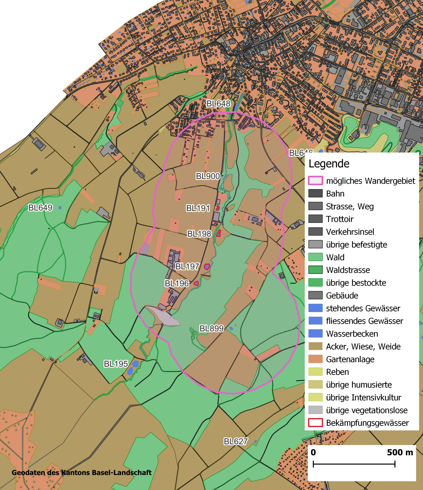

# Diskussion
## Validierung

Das Ziel eines jeden Modells ist es, gewisse Aspekte der realen Welt adäquat nachzubilden. Mit der Validierung wird überprüft, ob dies gelungen ist. Dazu werden hier zwei unterschieldiche Ansätze verfolgt. Die qualitative Validierung fokussiert auf das konzeptionelle Modell und stütz sich auf die Meinung von Experten ab. In diesem Fall wird die generelle Funktionsweise des Modells in Textform einer Expertin vorgelegt.

Die quantitative Validierung hingegen vergleicht Messdaten aus der realen Situation mit den Äquivalenten aus dem Modell. Die einzigen Messdaten, welche vorliegen, sind die Zahlen aus den Fangaktionen. Während die Daten für das Jahr 2021 bereits für die Kalibrierung genutzt wurden, dienen die Fangzahlen aus dem Jahr 2022 für die Validierung.

### Qualitative Validierung {#valiQuali}

Die Rückmeldung der Experten auf das konzeptionelle Modell ist positiv. Als grösste Unsicherheit wird die Modellierung der Wanderungen benannt. Hier wird empfohlen eine Sensitivitätsanalyse durchzuführen um die Auswirkungen unterschiedlicher Wanderdistanzen zu testen. Die Wanderung wird im Modell von zwei Werten bestimmt, welche sich gegenseitig ergänzen. Dies ist der Parameter `migration_time`, welcher die Dauer der Wanderung in Tagen bestimmt, und die Wandergeschwindigkeit im Metern/Tag, welcher im Modell fix eingegeben wurde. Der Parameter `migration_time`wurde so kalibriert, dass die Anzahl besetzter Gewässer nicht zu gross wird (siehe Kapitel \@ref(kaliDauer)). Eine Sensitivitätsanalyse dieser Parameter würde also die Validität des Modells direkt beeinflussen und wurde deswegen verworfen.

### Quanitative Validierung

Die Validität des Modells wird hier anhand der Fangzahlen aus dem Jahr 2022 überprüft. Die Fangzahlen sind in Tab. \@ref(tab:tablecatches) zusammengefasst, im Jahr 2022 wurden demnach `r sum(adu22tot$Anzahl)` adulte Kammmolche gefangen. die modellierten Fangzahlen aus dem Jahr 2022 sind in \@ref(fig:val) dargestellt. Dafür wurden die Daten aus sämtlichen Resultatdurchgängen mit beiden Modellversionen verwendet. Das sind insgesamt `30` Durchgänge (`3` Szenarien,  `5` Durchgänge, `2` Versionen). Die gestrichelte Linie zeigt die tatsächlich gefangenen Tiere an. Wie unschwer zu erkennen ist, werden im Modell viel weniger Tiere gefangen als in echt. 

```{r val, echo=FALSE, fig.cap="Gefangene Kammmolche im Jahr 2022 über alle Modellläufe", out.width="60%", fig.show='hold'}
graph_val
plot(NULL, xaxt='n', yaxt='n', bty='n',ylab='',xlab='',xlim=0:1,ylim=0:1)
legend("topleft",
       legend="Zielwert",
       bty='n',
       lty=2,
       lwd=3,
       col=c("black")
       )

```

Bei den Durchläufen mit Fangwahrscheinlichkeit von `80%` und `95%` liegen die Fangzahlen zwischen `r min(data_tot$data_catch_diff[data_tot$data_catch_prob > 0.7])` und `r max(data_tot$data_catch_diff[data_tot$data_catch_prob > 0.7])` gefangenen Tiere. Die Mittelwerte in diesen Szenarien liegt ungefähr bei der Hälfte des erwarteten Wertes. Das Modell kann aufgrund dieser Ergebnisse **nicht** als valide eingestuft werden. Dies ist nicht zwingend darauf zurückzuführen, dass die grundsätzliche Mechanik im Modell nicht korrekt ist, sondern kann mehrere Ursachen haben:

1. Das Modell ist schlecht kalibriert
2. Der Mechanismus, wie im Modell Tiere gefangen und gezählt werden, funktioniert nicht korrekt
3. Die Entwicklung und Ausbreitung der Kammmolche ist schlecht modelliert
4. Weitere noch unbekannte Ursachen

Die Kalibrierung kann überprüft werden, indem die modellierten Fangzahlen 2021 angeschaut werden. Die Grafik in Abbildung \@ref(fig:val2) zeigt die modellierten Fangzahlen aus dem Jahr 2021. Die gestrichelte Linie markiert auch hier die Fangzahlen aus dem Jahr 2022. Die Fangzahlen 2021 sind mit Unsicherheiten behaftet (siehe Kapitel \@ref(daten)) und so wird die Vergleichbarkeit der beiden Darstellungen erhöht.

```{r val2, echo=FALSE, fig.cap="Gefangene Kammmolche im Jahr 2021 über alle Modellläufe", out.width="60%",fig.show="hold"}
graph_val2
plot(NULL, xaxt='n', yaxt='n', bty='n',ylab='',xlab='',xlim=0:1,ylim=0:1)
legend("topleft",
       legend="Zielwert",
       bty='n',
       lty=2,
       lwd=3,
       col=c("black")
       )

```

Die Grafik zeigt ein markant anders Bild. Das Modell produziert im Jahr 2021 Fangzahlen, welche sehr gut mit den tatsächlichen Zahlen übereinstimmen. Der Schwankungsbereich ist zwar gross (80%: `r min(data_tot$data_catch_2021[data_tot$data_catch_prob==0.8])` - `r max(data_tot$data_catch_2021[data_tot$data_catch_prob==0.8])`). In den meisten Durchgängen mit Fangwahrscheinlichkeit von `
80% oder mehr, liegen die Fangzahlen 2021 jedoch deutlich über `1000` Stück. Die Kalibrierung ist anhand dieser Betrachtungen als intakt zu beurteilen und kann nicht Ursache sein für die tiefen Fangzahlen 2022 und die negative Validierung.

Eine weitere mögliche Ursache für die negative Validierung erschliesst sich bei der Betrachtung der modellierten Fangzahlen auf der Zeitachse. Die Abbildung \@ref(fig:val3) zeigt sämtliche Fangzahlen aus dem Modell (Modellversion 2, Szenarien 80% und 95%)), die schwarze Linie zeigt dabei den Mittelwert und der grauen Bereich deckt die Spanne ab. Es fallen die starken Schwankungen ins Auge. Vor allem die Maximalzahlen fallen auf.
Die Fangzahlen brechen in regelmässigen Abständen stark ein und erholen sich innert einiger Jahre wieder. Es entstehen zyklische Schwankungen mit einer Frequenz zwischen fünf und zehn Jahren. Das Modell scheint Schwankungen zu produzieren, welche sich auch negativ auf die Validität auswirken.


```{r val3, echo=FALSE, fig.cap="Zeitreihe der Fangzahlen der Szenarien mit 80 und 95 Prozent Fangwahrscheinlichkeit", fig.show="hold", out.width="50%"}
graph_val_year
plot(NULL, xaxt='n', yaxt='n', bty='n',ylab='',xlab='',xlim=0:1,ylim=0:1)
legend("left",
       legend=c("Mittelwert","Minimum/Maximum"),
       bty='n',
       lty=c(1,1),
       lwd=c(2,15),
       col=c("black",rgb(150,150,150,max=255,alpha=100)),
       title=c("Legende")
       )
```

Auffällig in der Darstellung der zeitlichen Verläufe sind neben den zyklischen Schwankungen auch die Tatsache, dass die einzelnen Modelldurchläufe recht ähnliche Muster produzieren. Die Spitzen der Schwankungen laufen sehr spitz zu, was darauf hindeutet, dass in allen Modelldurchläufen die Schwankungen im gleichen Zeitraum auftreten. Die Fangzahlen in Tab. \@ref(tab:tablecatches) deuten nicht darauf hin, dass im realen Ökosystem ebenfalls ähnliche Schwankungen auftreten. Obwohl hier nur Daten aus zwei Jahren vorliegen, muss davon ausgegangen werden, dass die Population keine solche Schwankungen aufweist. Auch in der Literatur sind keine Hinweise auf ausgeprägte Populationsschwankungen zu finden. 


```{r val-alle, echo=FALSE, fig.cap="Verläufe der Kammmolchpopulation über den ganzen Zeitraum", fig.show="hold", out.width="50%"}
graph_val_sim_1
graph_val_sim_2
```

Die Vermutung, dass das Modell immer in den gleichen Zeiträumen Maximalwerte produziert, wird auch mit der nächsten Darstellung überprüft. Die Grafiken in Abbildung \@ref(fig:val-alle) zeigen die Anzahl adulter Kammmolche in sämtlichen Modelldurchläufen jeweils als separate Linie. In der linken Grafik sind die Resultate aus der ersten Modellversion abgegbildet, in welcher nur in bestimmten Gewässern bekämpft wird. Die rechte Grafik zeigt die Resultate aus der zweiten Version, wo in allen Gewässern Kammmolche abgefangen werden. In beiden Grafiken sind 15 Durchgänge abgebildet. Durch die separate Darstellung der einzelnen Modelldurchläufe kann abgeschätzt werden, ob die Zyklen zufällig entstehen oder auf eine Mechanik im Modell zurückzuführen sind. In ausnahmslos allen Durchläufen gibt es Spitzen in den beiden Jahren 2016 und 2021. Das ist noch bevor die Bekämpfung gestartet wird und beide Modellversionen die gleiche Voraussetzung haben. Die Modellversion mit der verstärkten Bekämpfung (rechte Grafik) zeigt auch über den restlichen Modellraum sehr ausgeprägte Spitzen immer in den gleichen Jahren. In der ersten Modellversion liegen die  Spitzen nicht exakt aufeinander. Wenn einzelne Linien betrachtet werden, sind aber auch dort die zyklischen Schwankungen sichtbar. Daraus kann gefolgert werden, dass die Schwankungen sehr wohl aus einer Mechanik im Modell entspringen, da sie offensichtlich nicht zufällig sind. Die Quelle ist aber nicht in der Bekämpfung zu suchen. 

Oszillationen kommen in Modellen mit verzögerten Rückkoppelungsmechanismen vor ("Bull whip Effect"). Der Effekt beruht darauf, dass ein Wert von einem anderen abhängt, die Abhängigkeit aber mit einer Zeitverzögerung eintritt. Das kann zu einer Überreaktion führen. Das Modell weist auf den ersten Blick keine zeitverzögerten Rückkoppelungen auf. Der Ursprung der Oszillation muss einen Einfluss auf die Anzahl adulter Kammmolche haben. Also kommt dafür wahrscheinlich ein Prozess bei der Berechnung der Sterblichkeit oder bei der Fortpflanzung in Frage. Die Fortpflanzung basiert auf einfachen Regeln, welche immer zum Zeitpunkt des Eierlegens angewendet werden. Eine Zeitverzögerung ist hier nicht feststellbar und die externen Abhängigkeiten beschränken sich auf die Anwesenheit des anderen Geschlechts. Die Sterberate ist in den meisten Fällen ebenfalls sehr einfach gehalten und weist keine Abhängigkeiten auf. Die Ausnahme dürfte die Ursache für die Oszillationen sein: die dichteabhängige Sterblichkeit der Larven. Dieser Prozess ist so konzipiert, dass die Sterblichkeitsrate nicht kontinuierlich angewendet wird sondern erst am Ende der Larvalphase. Zudem sind hier viele Individuuen davon betroffen. In dieser Phase werden die Individuuen nicht einzeln gerechnet sondern in Gruppen, welche alle die gleiche Mutter und das gleiche Alter aufweisen. Ein genauer Beschrieb des Prozesses ist Kapitel \@ref(dichtesterb) zu finden. Zu dem Zeitpunk, an welchem die Sterblichkeit auf die Larven angewendet wird, befinden sich möglicherweise sehr viele Tiere aus mehreren Gruppen im Gewässer. Das dürfte mitunter dazu führen, dass alle Larven der ganzen Gruppe absterben. Die dichteabhängige Sterblichkeit basiert auf einem quadratischen Zusammenhang: die Sterblichkeit steigt mit der Zunahme der Larven quadratisch an. Dies könnte dazuführen, dass die Sterblichkeit in manchen Zeitschritten über `1` liegt und alle Larven aus der ganzen Gruppe absterben. Falls mehrere Gruppen am gleichen Tag geschlüpft sind, könnten möglicherweise sogar mehrere Gruppen dahingerafft werden. Das könnte dazu führen, dass Abwechslungsweise sehr viele und sehr wenige Larven das nächste Stadium erreichen.
Ein weiteres Experiment bestätigt diese Theorie teilweise. In einer weiteren Modellversion, wird die Dichteabhängigkeit abgestellt und einen fixen Wert von `0.95` für die Sterblichkeit der Larven definiert. Zudem werden weitere Einstellungen vorgenommen: Bekämpfung der Kammmolche nur in den vorbestimmten Gewässern, Fangwahrscheinlichkeit für die Kammmolche ist `80%`. Das Modell ist dadurch nicht mehr kalibriert und kann keine glaubhaften Resultate liefern, das Experiment dient hier lediglich dazu die Ursache der Oszillation zu finden. Für dieses Experiment wird das Modell nur einmal durchgeführt und nur bis ins Jahr 2039 laufen gelassen. In \@ref(fig:val-kontr) sind die Anzahl adulter Kammmolche in diesem Durchlauf mit einem vergleichbarer Simulation aus den Resultatdurchgängen aufgetragen. Die ausgewählte Simulation ist ebenfalls mit der Modellversion 1 (Bekämpfung nur in spezifischen Gewässern) und der Fangwahrscheinlichkeit von `80%`.


```{r val-kontr, echo=FALSE, fig.cap="Vergleich zwischen einem Simulationsdurchgang und dem Kontrolllauf ohne Dichteabhängigkeit", out.width="50%"}
graph_dichte

```

Die Oszillationen scheinen tatsächlich abzunehmen. Die schwarze Linie zeigt das Ergebnis aus den Resultaten und weist in regelmässigen Abständen ausgeprägte Spitzen auf. Die grüne Linie stammt aus diesem Experiment und erscheint glatter. Die Schwankungen sind weniger regelmässig und sanfter. Allerdings ist das Verhalten des Modells auch in anderen Aspekten stark verändert. Mit der starren Larvensterblichkeit verläuft das Wachstum der Kammmolchpopulation viel gleichmässiger und offenbar exponentiel. Die dichteabhängige Sterblichkeit führt hier zu einer volatileren, unbeständigerer Entwicklung mit stärkeren Schwankungen. Es ist schwer aufgrund dieser Datenbasis eine stichhaltige Aussage zu tätigen. Es scheint aber so, dass der Ursprung der Oszillationen zumindest teilweise in dem Prozess der dichteabhängigen Sterblichkeit zu suchen ist.

## Besiedelte Gewässer
Die Abbildungen \@ref(fig:karte-bes1) und \@ref(fig:karte-bes1) zeigen die besiedelten Gewässer. Hier ist gut ersichtlich, dass einige Gewässer sehr regelmässig besiedelt werden, was in der Realität nicht beobachtet wird. Die betrifft hauptsächlich die Gewässer mit der Nummer BL899, BL900, BL901, BL649 und BL195. Diese Gewässer gelten als nicht besiedelt, einzig in BL195 wurden einzelne Tiere nachgewiesen. Welche Gewässer besiedelt werden, liegt hauptsächlich vom Wandervermögen der Tiere ab. Im Modell gibt es die Weitwanderer, welche grosse Strecken laufen können und selten auftreten. Lässt man diese ausser acht, kann das theoretisch besiedelbare Gebiet gut berechnet werden. Die Anzahl Wandertage ist durch die Kalibrierung eingestellt auf 13 Tage. Die Wandergeschwindigkeit pro Tag liegt bei 10 Meter für Adulte und 15 Meter für Juvenile. Nach Ablauf der Wanderzeit sind die Tiere also maximal 195 Meter von ihrem angestammten Gewässer entfernt. Danach wandern sie in das nächste Gewässer, welches demnach ebenfalls maximal 195 Meter entfernt sein darf. Die maximal zu überbrückende Distanz zwischen den Gewässern beträgt also 390 Meter. In Abbildung \@ref(fig:map_wandergebiet) ist das Gebiet dargestellt, welches mit dieser maximalen Wanderdistanz theoretisch besiedelbar wäre.

``` {r map-wandergebiet, echo=FALSE, fig.cap="Ohne Weitwanderer theoretisch Besiedelbares Gebiet", out.width="60%"}

```

Die Gewässer BL195 und BL649 liegen deutlich ausserhalb dieses Gebietes. Das bedeutet, dass die vielen Besiedelungen dieser beiden Gewässer durch die Weitwanderer zustande kam. Die Rate der Weitwanderer wurde im Modell aufgrund der Literatur angenommen und auf einen Wert von einem Individum von hundert Wanderern festgelegt. Die Tatsache, dass diese Gewässer dermassen oft besiedelt werden, deutet darauf hin, dass dieser Parameter zu hoch gewählt ist und angepasst werden müsste.

Es bleiben die Gewässer BL899, BL900 und BL901, welche im Modell besiedelt werden und in der Realität nicht. Bei genauerer Untersuchung stellt sich heraus, dass das Gewässer BL900 mit hoher Wahrscheinlichkeit kein oder nur sehr wenig Wasser führt und deshalb wahrscheinlich durch Kammmolche nicht besiedelbar ist.
Die letzte unerklärte Diskrepanz sind die beiden Weiher BL899 und BL901. Diese liegen sehr nahe beieinander und innerhalb der Wanderdistanz zu den besiedelten Gewässern. Hier gibt es keine augenfälligen Hinweise auf eine ungenügende Qualität:  Es drei Möglichkeiten dies zu erklären: 

1. Die Gewässer sind unentdeckt besiedelt
2. Die Gewässer weisen unbekannte Eigenschaften auf, welche den Kammmolchen verunmöglicht hier zu Laichen.
3. Es bestehen Wanderhindernisse, welche das Auffinden dieser Gewässer stark erschweren.


