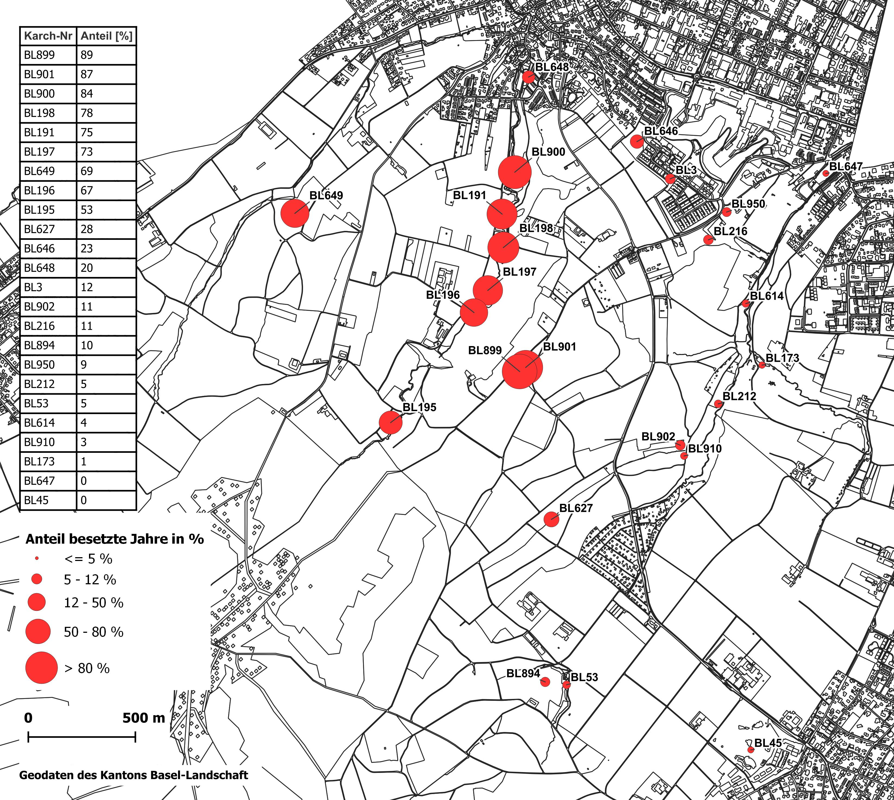
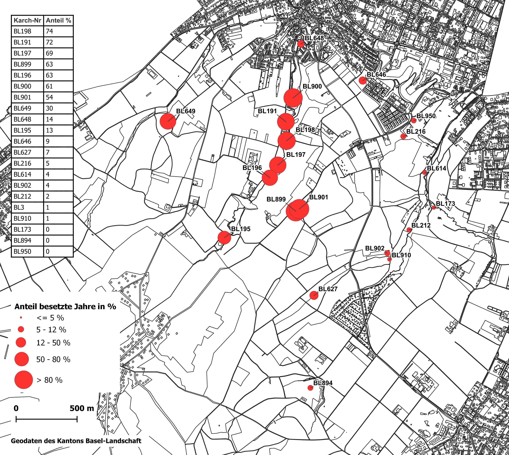

<!-- Einführung Rmarkdown Unigis: https://unigis-salzburg.github.io/Opt_AppDev-R/
Installation TinyTex:
 ```install.packages('tinytex')
 tinytex::install_tinytex()
 install.packages('rmarkdown')
 ```
-->

```{r setup, include=FALSE}
knitr::opts_chunk$set(echo = FALSE)
```


```{r, include=FALSE}
options(tinytex.verbose = TRUE)
```
```{r, include=FALSE}
source("rSkripte/tab_parameter.R")
source("rSkripte/felddaten.R")
source("rSkripte/kalibration_density.R")
source("rSkripte/kalibration_migration.R")
source("rSkripte/resultate.R")
source("rSkripte/validierung.R")
source("rSkripte/noDichtesterb.R")
```

# Einleitung

## Eingeschleppte Arten
Eingeschleppte Arten gehören gemäss @clavero2005invasive zu den stärksten Gefährdungsursachen bei Tieren auf der roten Liste der internationalen Union zur Bewahrung der Natur (IUCN). Dabei werden für 54% der untersuchten, ausgestorbenen Arten zumindest eine teilweise Ursache in standortfremden Arten ermittelt. @blackburn2019alien ermittelt invasive Spezies als Hauptursache für das Aussterben von 25.5% von kürzlich ausgestorbenen Pflanzenarten und 33.4% für die untersuchten Tierarten. Die effektive Bekämpfung von invasiven Species ist demnach eine wichtige Massnahme um dem Aussterben von weiteren Arten entgegen zu wirken.

Die rote Liste der Amphibien der Schweiz [@schmidt2005rote] weist 70% der vorkommenden Amphibienarten (14 von 20 Arten) einen Gefährdungsstatus zu. Gründe dürften im Landschaftswandel liegen [@schmidt2015amphibien], welcher das Vorkommen von geeigneten Laichgewässern stark verändert hat. Aufgrund der ohnehin prekären Situation, sind Amphibien besonders von der Einschleppung invasiver Species betroffen. 

Im vorliegenden Fall treffen der heimische Nördliche Kammmolch (Triturus cristatus) und der eingeführte Südliche Kammmolch (Triturus carnifex) aufeinander. Beide Arten sind auf der roten Liste der Schweiz als stark gefährdet eingestuft [@schmidt2005rote]. Während der Italienische Kammmolch natürlicherweise nur auf der Alpensüdseite vorkommt, besiedelt der Nördliche Kammmolch weite Teile Europas nördlich der Alpen. Die Alpen wirken demnach als natürliche Barriere. Die Vorkommen der südlichen Art auf der Alpennordseite sind in den meisten Fällen auf Verschleppungen zurückzuführen, einzig in einer schmalen Kontaktzone östlich der Alpen besteht eine Gebiet mit natürlichem Aufeinandertreffen beider Arten [@meilink2015genetic]. In Bereichen mit eingeschleppten Italienischen Kammmolchen, wurde jeweils ein Rückgang des Nördlichen Kammmolches dokumentiert. (Niederlande: @meilink2015genetic; Genf: @arntzen1999geneva)

## Modellierungen in der Biologie
Sowohl in der Förderung von bedrohten Tierarten, als auch in der Bekämpfung von Schadorganismen sind fundamentale Kenntnisse der Populationsdynamik hilfreich. Die Populationsdynamik beschreibt Faktoren wie Entwicklungsstadien, Ausbreitungsverhalten, Fortpflanzung und Sterblichkeit und bringt diese in einen Zusammenhang. Für solche Untersuchungen werden häufig statistische oder mathematische Modelle verwendet (z.B: @caudera2021mathematical, @la2017understanding). @vimercati2021cost zeigt an einem Beispiel in Südafrika auf, wie Populationsmodelle die gezielte Bekämpfung von invasiven Amphibien und den Mitteleinsatz verbessern können. Diese Modelle lassen grundsätzlich Aussagen auf Systemebene zu. @vimercati2017integrating ergänzen bestehende mathematische Modelle um den Landschaftswiderstand um die effektive Ausbreitung in einer konkreten räumlichen Umgebung zu simulieren. Dennoch bleiben räumliche Ausprägungen in dem Modellen nur marginal berücksichtigt. Aspekte wie Wanderhindernisse und Vernetzungskorridore können die Populationsdynamik entscheidend beeinflussen. Mittels agentenbasierten Methoden, lassen sich konkrete räumliche Beziehungen darstellen [@della2014simulating].

Agentenbasierte Modellierungsansätze bieten Möglichkeiten um die Modelle mit räumlichen Gegebenheiten und einer vielzahl von Verhaltensweisen und -Regeln zu ergänzen [@deangelis2014individual]. So entstehen Modelle, welche die Entscheidungsstrukturen in biologischen Systemen nachbilden, vor allem wenn sie mit stochastischen Elementen ergänzt werden. Dabei können überraschende Muster entstehen (genannt "Emergenz"), welche durch formelbasierte Ansätze nicht replizierbar sind.


## Italienischer Kammmolch (Triturus carnifex)
Das im Rahmen dieser Masterarbeit entwickelte Modell bildet die individuellen Lebenszyklen der Kammmolche nach. Für die Nachbildung der individuellen Lebensgeschichten der Kammmolche ist ein einigermassen tiefgehendes Verständnis der Lebensweise notwendig. Hier werden wesentliche Aspekte der Biologie von kammmolchen zusammengefasst. Die Lebensweisen von Italienischem Kammmolch (Triturus carnifex) und Nördlichem Kammmolch (Triturus cristatus) ähneln sich zuweilen stark, andere Aspekte sind nur von einer Art detailliert bekannt. Für die vorliegende Arbeit werden wissenschaftliche Erkenntnisse von beiden Arten meist als gleichbedeutend aufgefasst.

### Jahreszyklus
Kammmolche sind für die Fortpflanzung auf stehende Gewässer angewiesen. Adulte Tiere verbringen grosse Teile des Jahres an Land und wandern im Vorfrühling in die Gewässer ein. Dort findet die Paarung und die Laichablage statt. Dabei legt das Weibchen `200` bis `400` Eier ab [@jehle2011crested] und tarnt jedes Ei einzeln mit einem Blatt [@meyer2009schlangenspuren]. Vermutlich ist diese intensive Laichpflege der Grund, warum Weibchen nach dem Laichen mehrjährige Pausen einlegen [@schwizer2007population]. In diesen Pausen bleiben sie auch zur Laichzeit den Gewässern fern. Nach der Fortpflanzung wandern die Tiere in die Landlebensräume ein, welche sich meist direkt neben den Gewässern, selten bis zu wenigen hundert Metern entfernt liegen [@stoefer2001zeitliche].


### Entwicklungsstadien
Die Weibchen legen 200-400 Eier [@meyer2009schlangenspuren]. Aufgrund eines genetischen Phänomens stoppt bei der Hälfte der Eier die Entwicklung und die Embryonen sterben ab. Grund dafür sind unterschiedliche Ausprägungen des Chromosom 1. Embryonen, welche zwei gleichartige Chomosomen 1 besitzen, sterben demnach ab und Individuen mit beiden unterschiedlichen Ausprägungen sind überlebensfähig [@horner1985normal]. Die Mortalität der geschlüpften Larven ist ebenfalls relativ hoch, lediglich 5% der Larven erreichen die Metamorphose [@laufer2007amphibien]. Vieles spricht für eine dichteabhängige Sterblichkeit im Larvenstadium (persönliche Informationen B. Schmidt, @van2007body, @schabetsberger1995alpine). Insbesondere der hohe Energiebedarf dürfte zu einem starken Konkurrenzdruck bei der Nahrungsbeschaffung führen.


<!-- @schabetsberger1995alpine schätzt in einem alpinen Karstsee von rund 40'000 m2 die Anzahl Larven von T. alpestris nach einem ausserordentlichen warmen Sommer auf 30'000, was ein Maximalwert für diesen Standort darstellen dürfte. -->

### Wanderungen {#introWanderungen}
Für die Nördlichen Kammmolche wird eine hohe Laichgewässertreue ermittelt [@jehle2007wanderleistung, @mori2017twenty]. Eier werden meist in das gleiche Gewässer gelegt werden, in dem das Tier selber geschlüpft ist. Der kleinere Teil der Population wechselt das angestammte Laichgewässer. Gemäss @kupfer2000population sind `r round(100/83,1)`% der adulten Kammolche (1 von 83) und 13 von 35 (`r round(1300/35,1)`%) der Juvenilen in einem anderen Gewässer gefunden worden, als sie selber geschlüpft sind. Die Wanderungen beginnen nach der Fortpflanzung. Die Wandergeschwindigkeit ist bei juvenilen Kammmolche etwas höher (500m gemäss @kupfer1998wanderstrecken) als bei adulten Individuen (293m gemäss @stoefer2001zeitliche). Gemäss @jehle2007wanderleistung konnte zudem mittels genetischen Methoden nachgewiesen werden, dass nur sehr wenige Individuen (ca. 1 pro Jahr und Population) mit sehr grosser Wanderleistung (etwa das vierfache des Normalen) für die Verbindung zu entfernten Populationen verantwortlich sind. Mehrere Sinne sind an der Orientierung beteiligt. Die geruchliche Wahrnehmung wird dabei als wichtiger Sinn erachtet, auch für die Orientierung über grössere Distanzen [@weiss2021olfaction]


## Bekämpfungsprojekt
In Allschwil wurden seit den frühen 2000er- Jahre Kammmolche festgestellt, welche sich später als Italienische Kammmolche entpuppten. Zum Schutz der bedeutenden Population an Nördlichen Kammmolchen, und wohl auch zum Schutz der bereits in diese getätigten Investitionen, werden seit dem Jahr 2021 Bekämpfungsmassnahmen ergriffen.
Dazu werden jeweils Anfang Jahr die Weiher mit den beobachteten Vorkommen mit Amphibienzäunen hermetisch abgeriegelt. Amphibien, welche die Gewässer aufsuchen um sich fortzupflanzen, stossen nun an diese Zäune und fallen in Kessel, welche in regelmässigen Abständen an den Zäunen eingelassen sind. Bei täglichen Kontrollen werden die Tiere in den Kesseln bestimmt und gezählt, die Kammmolche werden später noch gewogen. Diese erhobenen Daten aus den Jahren 2021 und 2022 stehen für diese Arbeit zur Verfügung.

## Fragestellung {#fragestellung}
### Forschungsfrage
Untersuchung der Populationsdynamik des Italienischen Kammmolchs (Triturus carnifex) im Mühlebachtal in Allschwil anhand agentenbasierter Modellierung und Abschätzung der Erfolgsaussichten der bestehenden Bekämpfungsstrategie.

### operative Teilfragen
- Erstellen des Modells
- Kalibrieren des Modells anhand der erhobenen Daten
- Untersuchen der Populationsentwicklung bis zum Jahre 2050
- Validieren des Modells

# Material und Methoden
## Untersuchungsgebiet {#untersuchungsgebiet}
Das Untersuchungsgebiet besteht aus einem 8 * 8 km grossen Quadrat in der Nordwestecke der Schweiz. Es reicht bis an die Kantonsgrenze zu Basel-Stadt im Norden sowie an die Landesgrenze zu Frankreich im Westen. Es deckt auf Schweizer Seite die Gemeinden Allschwil, Biel-Benken, Binningen, Bottmingen und Oberwil teilweise ab. Am Rand des Untersuchungsgebietes liegen Basel-Stadt und Frankreich. Die Lage des Untersuchungsgebietes ist auf der Übersichtkarte in Abbildung \@ref(fig:uebersichtskarte) schwarz umrandet. Die Gebiete ausserhalb des Kantons Basel-Landschaft werden grösstenteils ausgeschlossen. Sie liegen peripher und spielen für den Untersuchungszweck eine untergeordnete Rolle. Ausnahme ist die französische Gemeinde Neuwiller (rot umrandet auf der Übersichtskarte). Diese liegt zwischen den Gemeinden Allschwil und Biel-Benken und liegt möglicherweise in der Reichweite der Kammmolche. Das Ausschliessen dieser Gemeinde würde die Aussagekraft des Modells einschränken. Aus diesem Grund wurde diese Gemeinde in das Modell integriert.
```{r 'uebersichtskarte',echo=FALSE,out.width="100%",fig.cap="Das Untersuchungsgebiet (schwarz umrandet) auf der Landeskarte im Massstab 1:100'000"}
knitr::include_graphics("./bilder/Uebersicht100.jpg")
```
Die tatsächlich beobachteten Vorkommen der Kammmolche sind isoliert im Mühlebachtal in Allschwil (blaues Rechteck in Abbildung \@ref(fig:uebersichtskarte)) und umfassen wenige Gewässer. Das Untersuchungsgebiet wurde bewusst recht gross gewählt, um zu verhindern, dass die Agenten an die Ränder stossen und so möglicherweise die Aussagekraft des Modells beeinträchtigen.


## Modellbeschreibung
In den folgenden Absätzen, wird die Funktionsweise des Modells beschrieben. Die Struktur folgt dem ODD-Protokoll wie von @grimm2006standard vorgeschlagen und später in @grimm2010odd erweitert. 

### Vorbemerkungen
Das Modell unterhält zeitweise mehrere Tausend Agenten. Um die Lauffähigkeit des Modells sicherzustellen wurde es auch auf Ressourceneffizienz optimiert. Deshalb werden einige Lebensabschnitte der Kammmolche vereinfacht dargestellt, ohne die grundsätzliche Funktion zu beeinträchtigen. So sind die ressourcenintensiven, räumlichen Berechnungen auf ein Minimum reduziert. Das Modell ist stringent auf die beschriebenen Ziele (siehe Kapitel \@ref(fragestellung)) ausgerichtet und vernachlässigt Verhaltensweisen, welche für diese Ziele nicht relevant sind. So werden beispielsweise die saisonalen Wanderungen komplett ausgeblendet. Im Modell bleiben die meisten Tiere dauernd in den Gewässern. Wo für das Modell relevant, wird die Abwesenheit der Tiere mit anderen Techniken simuliert.


<!-- #### Saisonale Wanderungen -->
<!-- Kammmolche verbringen grosse Teile des Erwachsenenlebens ausserhalb der Gewässer und kommen lediglich für die Fortpflanzung in die Gewässer. An Land werden grössere Reisen unternommen ohne das angestammte Laichgewässer zu wechseln. Die Landausflüge sind für die Funktionsweise des Modells gänzlich irrelevant. Der Anteil der Population, welcher zur Fortpflanzungszeit in die Gewässer einwandert ist unbekannt und müsste im Modell angenommen oder in verschiedenen Szenarien abgebildet werden. Im Modell hat die Population in den Gewässern Einfluss auf die Anzahl der im Rahmen der Bekämpfungsmassnahmen gefangenen Tiere. Das Modell belässt die Tiere in den meisten Situationen unbeweglich in den Gewässern, was der tatsächlichen Lebensweise widerspricht. Es werden zwei Techniken angewandt um die Abwesenheit der Tiere zu simulieren, ohne diese tatsächlich wandern lassen zu müssen: -->

<!-- 1. Das Datum der letzten Fortpflanzung wird in einer Variabel im jeweiligen Agenten gespeichert. Die Fortpflanzung und die Abfangaktionen greifen nur bei Individuen, welche über eine bestimmte Zeit Fortpflanzungspause einlegten.  -->
<!-- 2. Weitere Unsicherheiten beim Abfangen werden mithilfe von Szenarien untersucht, siehe dazu Kapitel \@ref(szenarien). Hier wird nur ein gewisser Anteil der tatsächlich Fangbaren Individuen abgefangen. Damit werden die oben beschriebenen Unsicherheiten simuliert und weitere Faktoren wie gewisse Undichdigkeit der Fangnetze etc. -->

### Begriffe
In dieser Arbeit werden Begriffe aus der Biologie und aus der Modellierung verwendet. Hier werden die verwendeten Begriffe kurz erläutert:

- Agenten: In den meisten Fällen entspricht ein Agent im Modell einem Individum der realen Welt. Es handelt sich um eine Entität einer definierten Spezies. In Spezialfällen kann ein Agent viele Individuen beinhalten.
- Spezies: Definition der Agenten. Hier werden die Regeln festgelegt, wie sich die einzelnen Agenten zu verhalten haben.
- Parameter: Werte, welche das Verhalten des Modells beeinflussen. In der Regel können Parameter durch den Benutzer eingegeben werden.
- Variabeln:  Variabeln sind Werte, welche den Zustand von Agenten beeinflussen. Jeder Agent besitzt einen Strauss an Variabeln, welche beispielsweise Alter oder Geschlecht bestimmen.
- Population: Summe aller Individuen einer Art, welche in der selben Region leben und in regelmässigem (genetischen) Austausch stehen.
- sonstige?


### Zweck
Das Modell bezweckt die Nachstellung der Lebensweise von Italienischen Kammmolchen im Mühlebachtal in Allschwil bei Basel. Die Tiere sind hier standortfremd und werden zum Schutz einheimischer Tiere bekämpft. Anhand des Modells wird ergründet, wie sich die Population der Italienischen Kammmolche entwickelt und ausbreitet und geht der Frage nach ob die aktuell angewendete Bekämpfungsmethode erfolgreich sein wird. Das Modell ergründet folgende Leitfragen:

1. Ist es möglich mit der aktuellen Bekämpfungsmethode die Italienischen Kammmolche aus dem Gebiet zu entfernen?
2. Wie lange müssen die Bekämpfungsmassnahmen durchgeführt werden?

Dazu wird der gesamte Lebenszyklus vom Ei bis zu den ausgewachsenen Tieren modelliert.

-wanderungen
-fangen


### Räumliche und Zeitliche Auflösung
Das Modell arbeitet mit Vektordaten und verfügt somit nicht über eine definierte, räumliche Auflösung. Das Untersuchungsgebiet ist 8 x 8km gross und deckt die bekannten Vorkommen der Italienischen Kammmolche grosszügig ab. Details zum Untersuchungsgebiet siehe Kapitel \@ref(untersuchungsgebiet).
Die zeitliche Auflösung beträgt einen Tag. Jeder Zeitschritt im Modell entspricht einen Tag im Leben der Kammmmolche. Als Startzeitpunkt wird derjenige Moment angenommen, an dem die Kammmolche ins Mühlebachtal kamen. Es handelt sich mutmasslich um eine Aussetzung in den frühen 2000'er- Jahren. Das Startdatum wird auf den 1.1.2000 festgelegt. Als Enddatum ist der 31.12.2049. festgelegt.

### Agenten {#oddAgenten}
Das Modell bildet die Entwicklungszyklen, die Stadien und die spezifischen Wanderbewegungen der Kammmolche ab. Die Stadien werden in jeweils eigenen Spezies abgebildet, wobei die Stadien "Eier" und "Larven" in der Spezies `offspring` zusammengefasst sind. Die Spezies `migrant` dient der Modellierung der Wanderbewegungen und kann Agenten der Spezies `juvenil` und `adult` aufnehmen. Für die Visualisierung der Umgebung und die Steuerung von Wanderbewegungen werden Daten zur Bodenbedeckung verwendet, abgebildet in der Spezies `groundCover`. Das Modell verfügt über folgende Spezies: 

- `groundCover`: Bodenbedeckung, dient der Illustration der Umgebung und der Berechnung von Wanderhindernissen.
- `pond`: Laichgewässer, enthält die Einheiten aus `groundCover` welche den Typ `stehendes Gewässer` aufweisen.
- `offspring`: deckt die Entwicklungsstadien Eier und Larven ab.
- `juvenil`: jugendliches Entwicklungsstadium. Die Tiere weisen bereits praktisch das Aussehen von Erwachsenen auf, sind aber noch nicht Fortpflanzungsfähig.
- `adult`: Erwachsene, fortpflanzungsfähige Individuen.
- `migrant`: Wandernde Individuen, können juvenile oder adulte sein.

Der Übergang zwischen den Stadien ist in Kapitel \@ref(prozess) detailliert beschrieben.


### Modellvariabeln
Das Modell beinhaltet zahlreiche Variabeln, welche für die Steuerung der Prozesse, die Orchestrierung der Agenten und für die Auswertung der Resultate benötigt werden. Es wird unterschieden zwischen globalen Variabeln, welche auf Ebene des Modells festgelegt werden, und Variabeln der einzelnen Spezies.

Diese Variabeln bilden die eigentliche Aussage des Modells und zeigen wie viele Kammmolche in welchem Stadium zu jedem Zeitschritt vorhanden sind und in welchem Gewässer sie sich befinden. Zudem werden die Anzahl Tiere der einzelnen Stadien über den gesamten Zeitraum aufsummiert um einen Überblick über die Nachwuchs- und Sterblichkeitsrate zu erlangen. Weitere Variabeln dienen der Steuerung der Agenten und transportieren wesentliche Informationen beim Übgergang der einzelnen Stadien. In den folgenden Kapiteln sind die Variabeln aufgelistet, in Klammern ist jeweils der Datentyp angegeben.

#### Globale Variabeln
Die globalen Variabeln steuern die Modell-Zeit und aggregieren Zahlen aus den Spezies um Auswertungen vornehmen zu können.

- Zeitmanagement:
  - `starting_date` (Datum)
  - `end_date` (Datum)
  - `step` (Sekunden)
  - `seasons` (Schlüssel-Wert-Paar)
  - `seasonNow` (Ganzzahl)
  - `current_date` (Datum)
- Anzahl Tiere, über den ganzen Zeitraum aggregiert:
  - `eggs_tot` (Ganzzahl)
  - `larva_tot` (Ganzzahl)
  - `juv_tot` (Ganzzahl)
  - `adult_tot` (Ganzzahl)
  - `migrantJuv_tot` (Ganzzahl)
  - `migrantAdult_tot` (Ganzzahl)
- Aggregierte Informationen:
  - `occupiedPonds_count` (Ganzzahl)
  - `catched_adult` (Liste mit Fremdschlüsseln auf Spezies `adult`)
  - `catched_juvenil` (Liste mit Fremdschlüsseln auf Spezies `juvenil`)

#### Variabeln pro Spezies
  Bei Variabeln, welche nur zwei unterschiedlichen Werte annehmen können, wird jeweils ein Boolscher Datentyp (`wahr`/`falsch`) verwendet. Dies vereinfacht die Filterung der entsprechenden Individuen, ist einfacher zu prozessieren und weniger fehleranfällig. Die Bezeichnung der betreffenden Variabeln zeigt welche Bedeutung die Variabel annimmt, wenn sie `wahr` ist. Der andere mögliche Wert wird demnach durch den Wert `falsch` repräsentiert. Dies betrifft die Variabeln `isEgg` (`wahr`=Stadium Ei, `falsch`=Stadium Larve), `isJuvenil` (`wahr`=Stadium Juvenil, `falsch`=Stadium Adult) und `isFemale` (`wahr`=weiblich, `falsch`=männlich).
Andere Variabeln enthalten einen Verweis auf einen anderen Agenten. Dies ist der Fall bei der Variabel `nativePond`. Hier wird ein Fremdschlüssel auf den entsprechenden Agenten der Spezies `pond` gespeichert. Dadurch kann direkt von einem Individum auf Variabeln seines Laichgewässers zugegriffen werden. Folgende Variabeln werden auf Ebene Spezies festgelegt und ausgewertet:

- `groundCover`:
  - `type` (Text)
- `pond`:
  - `placeOfÈxposion`: (Bool)
  - `catchingNet`: (Bool)
  - `pondNumber`: (Text)
  - `area` (Gleitkommeazahl)
  - `newtCount` (Ganzzahl)
  - `densityLarva` (Ganzzahl)
- `offspring`: 
  - `nativePond` (Fremdschlüssel auf die Species `pond`)
  - `isEgg` (Bool)
  - `count` (Ganzzahl)
  - `layDate_egg` (Datum)
  - `hatchDate_larva` (Datum)
  - `location` (Koordinaten)
- `juvenil`:
  - `nativePond` (Fremdschlüssel auf die Species `pond`)
  - `isFemale` (Bool)
  - `dateDevelopment` (Datum)
  - `location` (Koordinaten)
- `adult`:
  - `nativePond` (Fremdschlüssel auf die Species `pond`)
  - `istFemale` (Bool)
  - `maturity` (Datum)
  - `lastReproduction` (Datum)
  - `isMigrant` (Bool)
  - `slipped` (Bool)
  - `location` (Koordinaten)
- `migrant`:
  - `isJuvenil` (Bool)
  - `nativePond` (Fremdschlüssel auf die Species `pond`)
  - `isFemale` (Bool)
  - `dateDevelopment` (Datum)
  - `lastReproduction` (Datum)
  - `location` (Koordinaten)

### Prozesse {#prozess}
Das Modell berechnet die Anzahl Kammmolche im ganzen Modell und in den einzelnen Gewässern bei jedem Zeitschritt. Für die Übergange zwischen den Stadien, die Wanderungen und die Sterblichkeit sind spezifische Prozesse definiert, welche folgend erläutert werden.

#### Formelbasierte Simulationen, Spezies `offspring`
Die ersten Stadien (Eier und Larven) sind an die Gewässer gebunden, umfassen sehr viele Individuen und sind von kurzer Lebensdauer. Sie unternehmen keine Wanderungen und interagieren nicht wesentlich mit anderen Individuen. Im Modell erhalten Sie die Aufgaben die Entwicklungsdauer und die natürliche Sterblichkeit nachzubilden. Wie in @WALLENTIN2017165 beschrieben, kann das Verhalten von vielen Individuen mit einer geringen räumlichen Verbreitung durch formelbasierte Ansätze adäquat und effizient modelliert werden. Diesem Ansatz folgend, bildet das Modell diese Stadien nicht als einzelne Individuen ab sondern in einer Nachwuchs-Einheit. Diese Einheit kann mit dem Begriff Schwarm versinnbildlicht werden und wird im Modell durch die Spezies `offspring` repräsentiert. Die einzelnen Individuen werden demnach nicht als eigenständige Agenten geführt, sondern durch Attribute eines grösseren Agenten repräsentiert. Beim Eier legen (siehe Kapitel: \@ref(reproduction)) entsteht pro Weibchen ein Agent der Spezies `offspring`. Dieser beinhaltet die Anzahl Nachfahren im Attribut `count` und das aktuelle Stadium im Attribut `isEgg`. In der ganzen Lebensdauer der Agenten dieser Spezies, werden zwei Arten von Sterblichkeit berechnet. Diese verändern die Variabel `count` und sind im Detail in den Kapiteln \@ref(dichtesterb) und in @horner1985normal erklärt. Es sind folgende Ereignisse betroffen: 

- Sterblichkeit beim Übergang vom Stadium "Ei" zu "Larve"
- Dichteabhängige Sterblichkeit der Larven

Diese Prozesse werden in den nachfolgenden Kapiteln erläutert. 

#### Fortpflanzung und Eier legen {#reproduction}
Weibchen legen Eier in ihr angestammtes Gewässer, welche in der Variabel `nativePond` gespeichert wird. Dies ist nicht jederzeit möglich, es müssen eine Reihe von Bedingungen eintreffen, damit Eier abgelegt werden können:

- Die Jahreszeit: Fortpflanzung findet in einem festgelegten Zeitraum statt.
- Es muss mindestens ein Männchen im gleichen Gewässer vorhanden sein wie das Weibchen.
- Seit der letzten Fortpflanzung ist die, durch den Parameter `reproductionBreak`, festgelegte Fortpflanzungspause verstrichen.

Beim Eier legen wird ein Agent der Spezies `offspring` mit folgenden Variabeln geschaffen:

- `isEgg` = `true`
- `count` = `parameter(clutchSize)`
- `nativePond` = `nativePond der Mutter`
- `layDate_egg` = `current_date`
- `location` = `location` der Mutter

#### Schlüpfen
Der Übergang zwischen dem Stadium Ei und Larve erfolgt beim Schlüpfen. Nur `50%` der Eier erreichen das Larvenstadium. Diese natürliche Sterblichkeit wird hier in der Veränderung der Variabel `count` angewendet. Der Übergang zwischen den Stadien wird einfach durch die Veränderung der Variabel `isEgg` von `wahr` auf `falsch` vollzogen. Es werden folgende drei Variabeln in der Spezies `offspring` verändert:

- `count` = `count * parameter(survival_egg)`
- `isEgg` = `false`
- `hatchDate_larva` = `current_date`


#### Dichteabhängige Sterblichkeit der Larven {#dichtesterb}
Im Larvenstadium wird eine dichteabhängige Sterblichkeitsrate eingeführt. Die Annahme ist, dass mit zunehmender Dichte die Sterblichkeit quadratisch ansteigt. Bei unbedeutender Dichte besteht ebenfalls eine Sterblichkeit, verursacht durch Krankheiten, Fressfeinde und weitere Faktoren. Die grundlegende Sterblichkeit entspricht der Sterberate bei unbedeutender Larvendichte und wird gestützt auf die Werte aus anderen Stadien  als `0.6` angenommen. Dies entspricht einer Überlebenswahrscheinlichkeit von `40%`. In der Grundformel $y=a*x^2 + b*x + c$ ist $y$ die Sterberate der Larven, $x$ ist die Larvendichte, $b$ wird auf 0 gesetzt, und $c$ entspricht der Grundsterblichkeit von `0.6`. Der Koeffizient $a$, welcher die Öffnung der Kurve und somit die Auswirkung der Dichte auf die Sterblichkeit bestimmt, wird im Kalibrationsprozess ermittelt (Kapitel \@ref(kalidichte)). Das Ergebnis beschreibt die Überlebenswahrscheinlichkeit der Larven über die ganze Lebensdauer. Es resultiert die Formel \@ref(eq:sterblarve) , wobei gilt:

- $S$=Sterblichkeit pro Tag
- $S_{grund}$ = Grundsterblichkeit
- ${Koeff}$ = Koeffizient
- ${Dichte}$ = aktuelle Larvendichte in $\frac{Anzahl}{m^2}$


\begin{equation}
{S = {Koeff}*{Dichte}^2+S_{grund}}
(\#eq:sterblarve)
\end{equation}

Die STerblichkeit wird nicht laufend angewendet, sondern beim Wechseln vom Stadium Larve in das Stadium Juvenil berechnet.

#### Entwicklung der Larven zu Juvenilen
Hier findet der Übergang vom formelbasierten zum individuenbasierten Paradigma statt. Beim erreichen des nötigen Alters (Parameter `maxAge_larva`) wird für jede überlebende Larve (ausgedrückt durch die Variabel `count`) ein Agent der Spezies Juvenil geschaffen. Wieviele Larven das nächste Stadium erreichen, wird über die dichteabhängige Sterblichkeitsrate bestimmt, siehe vorheriges Kapitel. Bei der Entwicklung zum Juvenilen werden eine Reihe Eigenschaften vom kreierenden Agenten (ursprünglich von der Mutter) übernommen. Das Geschlecht wird nach einem Zufallsmechanismus festgelegt. Es werden folgende Variabeln gesetzt: 

- `nativePond` = `nativePond` des kreierenden Agenten
- `location` = `location` des kreierenden Agenten
- `if random(1.0) >= 0.5: isFemale=true, else: isFemale=false`
- `dateDevelopment` = `current_date`
- `isMigrant` = `true`, ansonsten würde die Entscheidung übersprungen, ob eine Wanderschaft angetreten wird oder nicht

Nach dem Übergang vom Larvenstadium ins juvenile Stadium wird der kreierende Agent gelöscht.

#### Entwicklung vom Juvenilen zum Adulten
Der Übergang von den Juvenilen zum erwachsenen Tier wird über den Kalender terminiert. Beim Erreichen des vorbestimmten Alters (in Parameter `maxAge_juv`), wird folgender Prozess ausgelöst: 

```
if random(1.0) >= survival_juvenil:
  create adult
do die
```

Der juvenile Agent wird in jedem Fall gelöscht. Mit der Zeile `if random(1.0) >= survival_juvenil` wir die natürliche Sterblichkeit simuliert. Für jeden AGenten wird einen Zufallszahl zwischen `0` und `1` generiert. Ist diese Zufallszahl höher als der Parameter `survival_juvenil`, wird ein Agent der Spezies `adult` kreiert. Die Variabel `maturity` enthält dabei das aktuelle Modelldatum und kann für die Berechnung des Alters verwendet werden. Die Attribute des neuen Agenten `adult` werden wie folgt gesetzt:

- `nativePond = nativePond des kreierenden Agenten`
- `location = location des kreierenden Agenten`
- `isFemale = isFemale des kreierenden Agenten`
- `maturity = current_date`

#### Jährliche Sterblichkeit der Adulten
Die Spezies `adult` verfügt als einzige Spezies über eine jährliche Sterblichkeitsrate. Diese wird einmal im Jahr berechnet. Als Zeitpunkt für diese Berechnung wird der letzte Tag des Jahres gewählt. Für jeden Agenten wird in einem Zufallsereignis entschieden, ob er überlebt. Der Zufallsmeachnismus ist derselbe wie oben beschrieben. Die Wahrscheinlichkeit zu überleben wird im Parameter `survival_adult` festgelegt.

#### Wanderungen {#speciesMigrant}
Sowohl adulte Tiere als auch Juvenile unternehmen Wanderungen. Im vorliegenden Modell werden Wanderungen als ein Wechsel des angestammten Laichgewässers aufgefasst. Saisonale Wanderungen, wie sie in der Natur jährlich vorkommen und im gleichen Gewässer enden wie sie starten, werden nicht modelliert. Die wesentliche Funktion der Wanderungen im Modell ist die Ausbreitung der Population auf neue Gewässer. Die Wanderungen beginnen bei Adulten nach der Paarungszeit und bei Juvenilen sofort ab Erreichen des Stadiums. Für die Ausbreitungsleistung der Population sind zwei Faktoren verantwortlich: Die Dauer der Wanderungen und die Wandergeschwindigkeit. Die Wandergeschwindigkeit wird über die Literatur festgelegt und unterscheidet sich zwischen Juvenilen und Adulten. Die Wanderleistung beträgt hier `10m/Tag` für Adulte und `15m/Tag` für Juvenile  (Parameter `migration_velocity_adult` und `migration_velocity_juv`). Die Dauer der Wanderungen wird über eine Kalibration festgelegt. Diese dürfte sich aber im Bereich von 20 Tagen bewegen, um die belegten Ausbreitungsdistanzen von `293`m (adulte) und `500`m (juvenile) zu erreichen. Nähere Erläuterungen dazu im Kapitel \@ref(introWanderungen). Wenige Individuen verfügen jedoch über eine viel grössere Wanderleistung als die anderen und vermögen so, weiter entfernte Gewässer zu besiedeln. Im Modell wird dies durch die Anpassung der Wandergeschwindigkeit erreicht. Einer von tausend (0.1%) Wanderern verfügt über eine vierfache Wandergeschwindigkeit. Der Anteil der Population, welcher sich überhaupt auf Wanderschaft begibt ist bei 12% der Adulten und auf 37.3% der Juvenilen festgelegt (Parameter `migrationRate_adult` und `migrationRate_juv`). Die genannten Parameter geben dabei die Wahrscheinlichkeit an, dass ein Agent auf Wanderschaft geht. Diese Entscheidung findet nur einmal pro Stadium statt. Wenn das Los gegen eine Wanderung entscheidet wird die Variabel `isMigrant` auf `false` gesetzt, wodurch auch künftig keine Wanderungen unternommen werden können. Das gleiche geschieht nach einer abgeschlossenen Wanderung.

Die Wanderungen selber verlaufen bei beiden Spezies nach gleichem Muster:
Sie verlassen das Gewässer in einer zufälligen Himmelsrichtung. Bei jedem Schritt weichen sie zufällig `+/- 10°` vom Kurs ab. Die zurückgelegte Distanz wird auf durch die Parameter `migration_velocity_adult` und `migration_velocity_juv` bestimmt. Nach Ablauf der Wanderdauer (Parameter `migration_time`) wird das nächste Laichgewässer (Luftlinie) ermittelt und als neues angestammtes Gewässer hinterlegt. Danach führt die Wanderung direkt, ohne Kursabweichungen in das neue Laichgewässer.
Die Wanderung erfolgt unabhängig von der Umgebung, mit einer Ausnahmen: Tiere können nicht durch Gebäude wandern. Vor jedem Schritt wird vorausgeschaut ob ein Haus im Weg ist und die Wandergeschwindigkeit und Richtung so angepasst, dass die Hindernisse umgangen werden.

#### Bekämpfung
Ab dem Modelldatum 1.1.2021 werden Bekämpfungsmassnahmen simuliert. In der realen Welt werden Tiere bei der saisonalen Zuwanderung in die Gewässer mithilfe von fest installierten Zäunen gefangen. Kammmolche, welche in der Fortpflanzungspause sind, suchen keine Gewässer auf und können deshalb nicht gefangen werden. Im Modell werden diese saisonalen Wanderungen nicht simuliert. Deshalb werden nur Agenten gefangen, welche nicht in der Reproduktionspause sind und somit in die Gewässer wandern würden. Zudem werden nur an bestimmten Gewässern Zäune aufgestellt, diese sind in den Laichgewässer (Spezies `pond`) mit der Variabel `catchingNet = true` markiert. Die zuwandernden Kammmolche erhalten eine Chance (Parameter `probabilityCatch`) um durch die Zäune zu schlüpfen, oder anderweitig nicht gefangen zu werden. Falls dies gelingt, wird Variabel `slipped` auf `wahr` gesetzt. Nachfolgend sind die Kriterien aufgelistet, nach welchen zu fangende Tiere selektiert werden:

- `nativePond.catchingNet == true`
- `lastReproduction + reproductionBreak >= current_date`
- `slipped == false`
- `random(1.0) < parameter(probalityCatch)`

Die Wahrscheinlichkeit, mit welcher ein Agent gefangen wird, kann nicht eindeutig festgelegt werden, da dazu Zahlen fehlen. Deshalb werden drei Szenarien formuliert, anhand welcher Unsicherheiten bezüglich der Fangwahrscheinlichkeit getestet werden. Näheres dazu ist in Kapitel \@ref(szenarien) beschrieben. Die Szenarien bestimmen den Parameter `probabilityCatch`.


### Design Konzepte {#odd}
#### Grundlegende Prinzipien
Das Modell versucht äusserst komplexe, natürliche Abläufe abzubilden. Natürliche Prozesse sind nie starr auf einen Parameter ausgerichtet, sondern sind von dutzenden Faktoren abhängig. Das Modell ignoriert bei den meisten Einflussgrössen diese natürliche Bandbreite und legt einen festen Wert dafür fest. Eine Abbildung der Einflussgrössen mit einer zufälligen Schwankung birgt die Gefahr, dass das Modell chaotisch verläuft und die Resultate nicht nachvollziehbar sind. Deshalb basiert das Grundgerüsts des Modells auf starren Abläufen, welche sich nach dem Modelldatum und Parameterwerten richten. Wo immer möglich werden die Parameter anhand Angaben aus der Literatur festgelegt. Es wird bewusst darauf verzichtet, Schwankungsbereiche aus der Literatur mit zufälligen Ereignissen nachzubilden um ein möglichst eindeutiges Modell zu erhalten und chaotisches Verhalten zu verhindern. Dies betrifft zeitliche Entscheidungen, wie die Entwicklungsdauer der einzelnen Stadien, die Anzahl gelegter Eier sowie die Wandergeschwindigkeit. Die Sterblichkeitsrate wird ebenfalls als fester Wert implementiert, die Entscheidung ob ein Individum stirbt ist hingegen ein zufälliges Ereignis. Es wird eine Zufallszahl zwischen `0` und `1` generiert. Ist diese Zahl grösser als die Sterblichkeitsrate, überlebt das Individum. Weitere Entscheidungen sind nicht eindeutig durch die Literatur belegt und beruhen entweder auf Annahmen, werden durch Experimente bestimmt (siehe \@ref(kalibration))  oder werden mit Szenarien in das Modell implementiert (siehe Kapitel \@ref(szenarien)).
Dennoch ist es wünschenswert ein naturnahes Verhalten zu erreichen und gewisse Schwankungen in den Resultaten zuzulassen. Dies ermöglicht das Entstehen von unerwarteten Mustern und kann zum besseren Verständnis der realien Gegebenheiten führen. Wie dies erreicht wird, ist im nächsten Kapitel beschrieben.

#### Emergenz {#emergenz}
Die Emergenz ist eine Stärke der agentenbasierten Modellierung und beschreibt das Entstehen unerwarteter Muster. Diese ergeben sich durch das Zusammenspiel der individuellen Entscheidungen aller Agenten. Die Emergenz wird durch zufällige Ereigniss gefördert und durch festgelegte Regeln eher gebremst. Komplett starre Regeln werden immer zum gleichen Resultat führen. Allerdings führen zu viele zufällige Ereignisse zu chaotischem Verhalten und die Resultate mehrerer Durchgänge unterscheiden sich so stark, dass eine Kalibrierung des Modells oder die Interpretation der Resultate verunmöglicht wird. In diesem Modell werden deshalb so viele Parameter wie möglich auf einen Wert fixiert und nur gezielte zufällige Ereignisse eingesetzt. Das Modell verfügt über folgende Zufallsereignisse:

1. Selektieren eines bestimmten Anteils aller Agenten einer Spezies: Zufallsereignis, welches für jeden Agenten abgewendet wird und entscheided ob der Agent selektiert wird oder nicht. Selektiert beim Übergang der Stadien die Agenten welche Sterben, Auswahl der Agenten, welche auf Wanderschaft gehen, Auswahl der Agenten, welche durch die Fangzäune schlüpfen.
2. Wanderrichtung: zufällige Wanderrichtung zu Beginn der Wanderschaft und Anpassunge der Wanderrichtung in jedem Schritt.
3. Wanderdistanz: Auswahl der Agenten, welche weiter Wandern als die anderen.

Die ersten beiden Punkte beinhalten nur ein geringes Potential zur Emergenz, da von diesen Entscheidungen meist sehr viele Agenten betroffen sind.  Die erste Methode führt dazu, dass am Ende der Anteil selektiert wird, welcher hier als Parameter eingespiesen wird. Das entspricht auf Modellebene nicht einem richtigen Zufallsereignis, sondern hat eher die Wirkung einer formelbasierten Modellierung. Bei einer Sterblichkeit von `60%` werden am Ende ungefähr `60%` der Agenten sterben. Die Schwankungen, welche in dieser Rate zu erwarten sind, führen vermutlich eher selten zu unerwarteten Resultaten. Ebenso verhält es sich mit der Wanderrichtung. Je mehr Agenten auf Wanderschaft gehen, desto eher werden auch alle Himmelsrichtungen abgedeckt. Dieser Mechanismus führt zur einer gleichmässigen Verteilung der Wanderrichtung und ist ebenfalls eher nicht für überraschende Resultate verantwortlich.
Anders die Wanderdistanz. Durch die zufällige Auswahl von wenigen Agenten, welche über eine vergrösserte Wanderdistanz verfügen, können durchaus Überraschungen erwartet werden. Die Weitwanderer besiedeln neue Gewässer. Wenn es gelingt, dass auf diese Weise mehrere geschlechtsreife, adulte Agenten unterschiedlichen Geschlechts in einem Gewässer aufeinandertreffen, kann eine neue Population gegründet. Da die Weitwanderer sehr selten sind, ist es nicht vorhersagbar ob und schon gar nicht in welchen Gewässern neue Populationen entstehen können. 

Die wesentliche Kennzahlen der Verbreitung von Italienischen Kammmolchen im Projektgebiet sind die Anzahl Tiere sowie die besiedelten Gewässer. Das Verbreitungsgebiet wird durch die besiedelten Gewässer bestimmt. Zudem werden die Bekämpfungsmassnahmen bisher nur in wenigen Gewässern mit bekannten Vorkommen durchgeführt. Deshalb ist das Muster an besiedelten Gewässern in diesem Modell das entscheidende Merkmal. Würde die Emergenz in diesem Bereich fehlen, wäre sehr genau vorhersagbar, welche Gewässer besiedelt werden. Das würde das natürliche Verhalten nicht adäquat nachbilden. In diesem Modell dürfte dieser Mechanismus für naturähnliche Resultate verantwortlich sein.


#### Sensing
Sensing beschreibt die Wahrnehmung der Umgebung durch Agenten. Darauf basierend können Entscheidungen oder Verhaltensmuster an die Umwelt angepasst werden. Dieses Modell beinhaltet einen Prozess, welcher auf der Wahrnehmung der Umgebung basiert: die Wanderung. Die Agenten bewegen sich dabei zum grossen Teil unabhängig von Ihrer Umgebung. Die Ausnahme sind die Wanderhindernisse. Gebäude können nicht durchschritten werden, sondern werden umgangen. Bei jedem Schritt auf der Wanderung wird die Linie vorausberechnet auf welcher die Wanderung weiter verläuft. Kreuzt diese Linie ein Gebäude, wird die Wandergeschwindigkeit so angepasst, dass nur bis zum Gebäude hin gelaufen werden kann. Danach ändert die Laufrichtung zufällig bis das Gebäude umgangen ist oder die Wanderrichtung gänzliche angepasst wurde.


#### Stochastik
Das Modell basiert auf einer Mischung an stabilen Parametern und Zufallsereignissen. Die Zufallsereignisse sind hauptsächlich dichothome Entscheidungen (ja/nein), welche für jeden Agenten entscheiden, ob ein bestimmtes Ereignis eintritt oder nicht. Beispiele dafür sind die Sterblichkeit und die Wandertätigkeit. Diese Entscheidungen werden in diesem Kapitel \@ref(odd) genauer beschrieben. Auf eine Wiederholung wird hier deshalb verzichtet.

#### Observation
Das Modell soll Resultate produzieren, welche uns jederzeit Aufschluss über die Populationsgrösse geben. Zu diesem Zweck enthält das Modell diverse Ausgabemöglichkeiten. In Anzeigen können tagesaktuelle Daten angezeigt werden. Dazu gehören das aktuelle Modelldatum, die aktuelle Anzahl Agenten in jedem Stadium sowie eine Karte worauf der Standort der Agenten ersichtlich ist. Das entsprechende Interface des Gama-Models ist in Abbildung \@ref(fig:screenshot) ersichtlich. In der Karte sind nur die adulten Kammmolche und die wandernden Agenten dargestellt, da die Übersichtlichkeit sonst arg leidet. Die Wanderer sind zusätzlich mit einem Schwanz versehen um die Wanderrichtung und -Distanz anzuzeigen.

```{r 'screenshot',echo=FALSE,out.width="80%",fig.cap="Ein Screenshot auf das Interface des Gama- Modells"}
knitr::include_graphics("./bilder/screenshot_model_1.jpg")
```

In einem zweiten Fenster ist anstatt der Karte ein Diagramm mit dem Verlauf der Kennzahlen vorhanden (siehe Abbildung \@ref(fig:screenshotDiagramm). Hier werden in jedem Zeitschritt die aktuelle Anzahl der Agenten in allen Stadien aufgetragen und als Linie dargestellt. Weiter nützliche Information ist die Anzahl besiedelter Gewässer, welche hier als Balkendiagramm dargestellt ist. Die Höhe der Balken zeigt dabei die Anzahl adulter Kammmolche in diesen Gewässern. 

```{r screenshotDiagramm,echo=FALSE,out.width="80%",fig.cap="Ansicht der Diagramme im Gama-Modell"}
knitr::include_graphics("./bilder/screenshot_model_diagramm.jpg")
```


Diese Anzeigen sind aber für die Generierung von Resulaten und für Auswertungen nahezu zwecklos, sie dienen zur Veranschaulichung, um das Verhalten des Modells zu ergründen und für die Fehlersuche. Um Auswertungen vornehmen zu können, müssen die Daten in Tabellenform vorliegen, damit sie in einem externen Programm analysiert werden können. Für diesen Zweck gibt das Modell einmal im Jahr die aktuellen Zahlen als `.csv`- Tabelle aus. Diese beinhaltet dieselben Daten wie die Interfaces: aktuelle Anzahl sämtlicher Stadien, Anzahl besiedelte Gewässer, wesentliche Parameter wie die Fangwahrscheinlichkeit, und das aktuelle Datum. Sämtliche Auswertungen in dieser Arbeit wurden anhand dieser Daten getätigt. Für die Kalibrierung wurden im Modell separate Experimente angelegt, diese geben auch spezifische Daten als Tabellen aus.

### Initialisierung
Der Anfangszustands des Modells besteht aus einer Grundkarte und einer bestimmten Anzahl Kammmolche (Parameter `newtCount`) in einem Gewässer. Die Grundkarte besteht aus der Spezies `groundCover` und wird in Form eines Shape-Files geladen. Die Geometrien und die benötigten Attribute aus dem Shapefile werden in die Spezies `groundCover` geladen, wobei jede Geometrie als ein Agent behandelt wird. Mittels Attributen im Shapefile können die unterschiedlichen Typen von Bodenbedeckung identifiziert und entsprechend eingefärbt werden (Variabel `type`). Für genauere Beschreibung der verwendeten Daten, siehe Kapitel \@ref(bobe). Aus der Bodenbedeckung werden sämtliche potentiellen Laichgewässer in die Species `pond` verschoben. 

Das Gewässer, in welchem die Kammmolche zu Beginn des Modells freigelassenwerden, ist mit der Variabel `place_of_exposion = TRUE` markiert. Die Startpopulation an Kammmolchen wird auf einen Punkt innerhalb dieses Gewässers gesetzt und die Variabel `nativePond` erhält einen Verweis auf dieses Gewässer. Ausserdem werden folgende Variabeln gesetzt:

- `if random(1.0) >= 50 : isFemale=true else: isFemale=false`
- `maturity = starting_date - random(500)`
- `lastReproduction = maturity`

Dadurch werden den Kammmolchen zu Beginn zufällig ein Geschlecht zugeteilt und das Alter wird ebenfalls zufällig auf einen Wert zwischen 0 und 500 Tagen gesetzt. Dies ist wichtig, da ansonsten alle Agenten am gleichen Tag Eier legen würde und alle Nachfahren ebenfalls synchronisiert wären.

Das Modell wird durch viele Parameter gesteuert. Diese werden ebenfalls initial festgelegt. Die entsprechenden Werte sind in Tabelle \@ref(tab:para) aufgelistet.
```{r tab_parameter, echo=FALSE}
knitr::kable(tab_parameter,caption='Im Modell verwendete Parameter',label='para',"pipe")
```

### Verwendete Daten, Bodenbedeckung {#bobe}
Zu Darstellung der Umgebung werden Geodaten vom Kanton Basel-Landschaft mit Informationen zur Bodenbedeckung verwendet. Diese werden vom Kanton Basel-Landschaft erhoben und kostenlos über einen Downloaddienst zur Verfügung gestellt. Diese Informationen dienen der Steuerung von Wanderbewegungen und zur farblichen Darstellung der Landschaft im Modell. Die Vektordaten sind in einer hohen Genauigkeit erfasst und klassifiziert. Die verwendete Darstellung und vorhandene Bodenklassen sind in Abbildung \@ref(fig:gebietbb) ersichtlich. 
Die Landesgrenze beschreibt im Untersuchungsgebiet einen Bogen tief ins Landesinnere. Die Daten zur Bodenbedeckung sind nur auf Gebieten des Kantons Basel-Landschaft erfasst. In der erwähnten Lücke auf dem Boden der Gemeinde Neuwiller in Frankreich besteht ein Loch. Es kann jedoch nicht ausgeschlossen werden, dass Kammmolche ebenfalls durch diese Gebiete wandern. Die benötigten Oberflächendaten wurden hier anhand der 1:25'000 er Landeskarte der Schweiz von Hand grob abdigitalisiert. Erkennbare Strukturen, wie Gebäude, Siedlung, Strassen, Wälder, Landwirtschaftsland und Gewässer wurden dabei berücksichtigt (siehe Abbildung \@ref(fig:gebietbb)). Häuser wurden nicht mit dem realistischen Grundriss nachgezeichnet sondern durch ein standardisiertes Rechteck von ca. 100m2 ersetzt. Der Siedlungsraum wurde insgesamt als Gartenanlage modelliert. Das restliche Offenlad wurde dem Typ "Acker, Wiese, Weide" zugeordnet. Die Körnung ist deutlich gröber wie die Daten der amtlichen Vermessung.


```{r 'gebietbb',echo=FALSE,out.width="80%",fig.cap="Darstellung der Bodenbedeckung. Die Gewässer mit aktiven Bekämpfungsmassnahmen sind rot umrandet, die Beschriftungen zeigen die Identifikationsnummer der Gewässer. Am unteren, rechten Bildrand ist das Gebiet in Frankreich zu sehen."}
knitr::include_graphics("./bilder/Tal_Bekämpfungsgewässer.jpg")
```
Für die Steuerung des Modells wurden die Vektordaten zur Bodenbedeckung mit weiteren Attributen angereichert. Für die Identifizierung der einzelnen Gewässer werden Nummern verwendet, welche von der Koordinationsstelle für Reptilien und Amphibien Schweiz (karch) vergeben werden. Diese stammen aus dem Datensatz "Weiherinventar" im Geodatenviewer des Kantons Basel-Landschaft (siehe: [https://geoview.bl.ch/?map_x=2609487.9992678&map_y=1264906.4997948&map_zoom=4&tree_group_layers_Natur%20u.%20Landsch.=weiherinventar&tree_groups=Natur%20u.%20Landsch.](https://geoview.bl.ch/?map_x=2609487.9992678&map_y=1264906.4997948&map_zoom=4&tree_group_layers_Natur%20u.%20Landsch.=weiherinventar&tree_groups=Natur%20u.%20Landsch.)). Die Gewässer sind in der Abbildung \@ref(fig:gebietbb) mit der entsprechenden Nummer angeschrieben.
Im Weiherinventar sind zahlreiche Gewässer erfasst, welche in den Daten zur Bodenbedeckung nicht erfasst wurden. Diese Gewässer wurden manuell nacherfasst. Dabei wurde die genaue Form und Lage nicht berücksichtigt, die Fläche wurde hingegen der Angaben aus dem Weiherinventar angepasst.
Mithilfe der  Variabel `place_of_exposion` ist dasjenige Gewässer markiert, in welchem die Kammmolche mutmasslich ausgesetzt wurden (BL191) und die Variabel `catchingNet` zeigt diejenigen Gewässer an, welche für die jährlichen Bekämpfungsaktionen eingezäunt werden (in der Karte rot umrandet).


### Zähl- und Messdaten {#daten}
Seit Frühjahr 2021 werden in den Gewässern mit bekannten Vorkommen Kammmolche abgefangen. Die Tiere werden nach Stadium und Geschlecht bestimmt und gewogen. In der Tabelle \@ref(tab:tablecatches) sind die Fangzahlen aus den Jahren 2021 und 2022 aufgeführt. Das Gewässer BL195s wurde im zweiten Jahr nicht mehr für die Bekämpfung berücksichtigt. Andererseits fällt auf, dass im zweiten Jahr beinahe doppelt so viele Tiere abgefangen wurden. Zu erwarten wären eher, dass die Anzahl Tiere zurückgeht. Mit Blick auf den zeitlichen Verlauf der Fangaktion in Abbildung \@ref(fig:felddaten) lässt sich das auch anders einordnen:
Der erste Fangtag im Jahr 2021 war Anfang März. Bereits am ersten Fangtag wurde eine beträchtliche Anzahl Tiere gefangen. Dies deutet darauf hin, dass die Tiere schon früher mit der Wanderung begonnen hatten und möglicherweise bereits Tiere in die Gewässer gelangten, bevor die Fallen aufgestellt wurden. Im Jahr 2022 begann die Fangaktion bereits Anfang Februar. Im Jahr 2022 wurde vor dem 1.März insgesamt `r sum(catched22$Anzahl[catched22$dayofyear<64],na.rm=TRUE)` Tiere gefangen. Insgesamt kann angenommen werden, dass die Anzahl gefangener Tiere im Jahr 2021 stark unter der Anzahl tatsächlich eingewanderter Tiere liegt.

Die Gewichtsverteilung der gefangenen Adulten ist in Abbildung \@ref(fig:boxplotweight). Die Tiere scheinen im zweiten Fangjahr eher etwas leichter gewesen zu sein, als im ersten. Das könnte darauf hindeuten, dass bereits viele alten und grossen Tiere abgefangen wurden. Allerdings könnte das auch mit dem verzögerten Beginn der Fangsaison zusammenhängen.


```{r felddaten, echo=FALSE, fig.cap="Fangzahlen aus den ersten beiden Projektjahren"}
ggplot() +
  geom_col(data=eachDay_all[eachDay_all$year==2021,],aes(x=tag,y=Anzahl,fill='transparent'),alpha=0.5,
           color='black',linewidth=0.2, position='identity') + 
  geom_col(data=eachDay_all[eachDay_all$year==2022,],aes(x=tag,y=Anzahl,fill='black'),
           alpha=0.5, position='identity') + 
  labs(x="Datum",y="Total gefangener Tiere") +
  scale_x_continuous(breaks=seq(1,200,10),labels=date_label) +
  theme(axis.text.x = element_text(angle = 45)) +
  labs(fill = "Legend") +
  scale_fill_identity(name = "Jahr",
                       breaks = c("transparent", "black"),
                       labels = c("2021", "2022"),
                       guide = "legend")

```


```{r boxplotweight, echo=FALSE, fig.cap="Gewicht der gefangenen, adulten Tiere"}
ggplot(weight_all[weight_all$geschlecht!='J',],aes(x=geschlecht, y=gewicht)) +
  geom_boxplot() + 
  labs(x = "Geschlecht",y = "Gewicht") +
  coord_cartesian(ylim = c(0,15)) +
  facet_wrap(~year)
```

``` {r tablecatches, echo=FALSE}
opts <- options(knitr.kable.NA = "-")
knitr::kable(list(tabelle21,tabelle22),caption='Gefangene Tiere 2021 (links) und 2022 (rechts)',booktabs=TRUE,valign=TRUE)
```

## Szenarien {#szenarien}
Ziel der Abfangmassnahmen ist es, die Population an Italienischen Kammmolchen aus der Umwelt zu entfernen. Die Massnahmen sind so ausgelegt, dass jedes Jahr möglichst viele Tiere vor der Eiablage gefangen werden und die Population so langfristig geschwächt wird. Es kann jedoch angenommen werden, dass die Abfangmethode nicht 100% der Tiere erwischt. Folgende Faktoren sind unbekannt und müssen in den Szenarien berücksichtigt werden:

- Tiere befinden sich möglicherweise bereits in den Gewässern bevor die Zäune aufgestellt werden
- Tiere schlüpfen durch die Zäune
- Tiere legen Eier ausserhalb der eingezäunten Gewässer (seichte Stellen im Bach, temporäre oder sehr kleine Gewässer, ...)
- Tiere pflanzen sich in Gewässern fort, welche nicht überprüft werden (Gartenteich, Gewässer in Frankreich, ... )  

Diese Möglichkeiten lassen sich nicht quantifizieren. Im Modell sind diese Faktoren nicht in die Verhaltensweise der Agenten eingeflossen, weil sie die Komplexität und damit das chaotische Verhalten des Modells verstärken würden. Dadurch würde die Aussagekraft geschwächt. Diese Faktoren lassen sich zusammen als Effizienz der Fangmethode bezeichnen, da sie alle dazu führen, dass sich Tiere den Abfangzäunen entziehen. Da die Effizienz unbekannt ist, werden hier drei Szenarien angenommen, welche eine realistische Bandbreite abdecken:

1. optimistisches Szenario: 95% der Tiere werden abgefangen
2. mittleres Szenarion: 80% der Tiere werden abgefangen
3. pessimistisches Szenario: 50% der Tiere werden abgefangen


## Kalibrierung {#kalibration}
Das Modell verfügt über viele Parameter, welche zum Grossteil mit Werten aus der Literatur eingestellt werden können. Einzelne Faktoren sind durch die Literatur ungenügend abgedeckt und müssen über die Kalibration ermittelt werden. Dies betrifft die Wanderdauer und die dichteabhängige Sterblichkeit. Im Rahmen der Kalibration werden deshalb folgende zwei Parameter ermittelt:

- die Dauer der Wanderungen (Parameter `migration_time`)
- der Koeffizient der dichteabhängigen Sterblichkeit (Parameter `density_koeff`)

Beide Parameter beeinflussen sich gegenseitig nicht wesentlich, da sie grundsätzlich unterschiedliche Funktionen im Modell übernehmen. Daher können die beiden Parameter nacheinander kalibriert werden, ohne jede Kombination der beiden Parameter testen zu müssen. Für die Kalibrierung der Wanderdauer wird ein Wert für den Dichtekoeffizienten angenommen. Dieser Wert muss so eingestellt sein, dass genügend Kammmolche schlüpfen um in der Wanderphase in alle Himmelsrichtungen loszuwandern. Damit kann sichergestellt werden, dass das Auffinden der Gewässer durch die Wanderdauer beeinflusst wird und nicht durch einen Mangel an wandernden Individuen. Experimentell hat sich ein geeigneter Wert von 0,1 für den Dichtekoeffizient herausgestellt. Nach der Kalibrierung der Wanderdauer wird diese auf den ermittelten Wert fixiert und anschliessend der Dichtekoeffizient kalibriert.

Die Funktion des ganzen Modells ist es, die Populationsentwicklung abzubilden und die Wirkungsweise der Fangaktionen zu untersuchen. Es ist deshalb sinnvoll, bei der Kalibrierung eher ein Worst-Case-Szenario anzunehmen. Die zu kalibrierenden Werte werden im Zweifelsfall also eher mit einem Wert eingestellt, mit welchen die Kammmolche sich stärker vermehren und verbreiten.

### Wanderdauer {#kaliDauer}
Als beobachtete Grösse für diese Kalibrierung wird die Anzahl der besiedelten Gewässer verwendet. Wie im Kapitel \@ref(daten) gezeigt, konnten bisher nur in 5 Gewässern Kammmolche festgestellt werden. Es handelt sich um die Gewässer mit der Indentifikationsnummer BL191, BL195, BL196, BL197 und BL198. Es gilt nun, einen Wert für den Parameter der Wanderdauer zu finden, welcher ebenfalls zu einer Besiedelung dieser Gewässer führt. Das Modell soll die Möglichkeiten offen lassen, dass weitere Weiher unentdeckt besiedelt wurden. Deshalb ist als Zeilwert nicht die exakte Zahl von fünf besetzten Gewässern gesetzt sondern liegt im bereich zwischen fünf und sechs Gewässern.

Für die Kalibrierung wurde mit jedem Wert für die Wanderdauer das Modell fünf mal durchgeführt. Als Startdatum dient jeweils der 1.1.2000  und als Enddatum der 1.1. 2022. Die Parameterwerte der Wanderdauer in Tagen wurden experimentell auf den hier verwendeten Wertebereich eingeschränkt (`r time_levels`). Die Resultate sind in Abbildung \@ref(fig:kaliMigrant) gezeigt. Die senkrechten Linien zeigen dabei die Spanne und die Punkte den Mittelwert der Anzahl besiedelter Gewässer für jeden der drei Parameterwerte. Die grau Linie beschreibt die Regressionslinie, also die Gerade welche am Nächsten an allen Messpunkten liegt. Die waagrechten, gestrichelten Linien zeigen den Zielbereich von fünf bis sechs Gewässern. Es ziegt sich, dass der Paramaterwert von 13 genau auf der Regressionsgerade und auf dem Wert von 5.5 besetzen Gewässern liegt. Der Parameter `migration_time` wird für die folgenden Experimente also auf den Wert 13 eingestellt.


```{r kaliMigrant, echo=FALSE, fig.cap="Ergebnisse der Kalibration."}
ponds_graph
```


### Dichteabhängige Sterblichkeit {#kalidichte}

Der Prozess der dichteabhängigen Sterblichkeit ist im Kapitel \@ref(dichtesterb) eingehend beschrieben, ebenso die zugrundeliegende quadratische Gleichung. Der zu bestimmende Parameter ist der Koeffizient ($a$), welcher die Öffnung der quadratischen Funktion bestimmt. ($y = a*x^2 + bx + c$)
Für die Kalibrierung des Dichtekoeffizienten wird das Modell mehrere Male mit unterschiedlichen Parameterwerten durchgeführt und anhand der Resultate ein möglichst passender Wert für den Parameter bestimmt. 

Das Modell wird anhand der Daten der Fangaktion 2021 kalibriert (siehe Kapitel \@ref(daten) und Tabelle \@ref(tab:tablecatches)). 

Im Modell wird dieser Koeffizient durch den Parameter `density_koeff` bestimmt. Für die Kalibrierung dieses Parameters wurde das Modell mit unterschieldichen Werten jeweils 5 Mal durchgeführt. Der verwendete Wertebereich (`r koeff_levels`) wurde experimentel ermittelt. Die Auswirkungen des Dichtekoeffizienten sind in Abbildung \@ref(fig:kaliDichte) veranschaulicht. Es ist ersichtlich, dass sowohl die Streuung der Resultate als auch die absolute Anzahl der gefangenen Kammmolche mit grösserem Koeffizienten abnimmt. 
Wie in Kapitel \@ref(daten) beschrieben, sind die Fangzahlen aus dem ersten Jahr wohl nicht repräsentativ. Die Fangsaison war mutmasslich zu kurz und die Anzahl gefangener Individuen wäre wohl ungefähr doppelt so hoch ausgefallen, wenn das Abfangen schon früher begonnen hätte. Als Zielwert für die Kalibrierung wird hier eine Zahl zwischen 700 und 1200 angestrebt. Wie in der Abbildung \@ref(fig:kaliDichte) ersichtlich, liefert von den getesteten Werten einzig der Dichtekoeffizient` 0.01` einen Wert innerhalb des angestrebten Bereich. Allerdings wird ein Wert gesucht, welcher Resultate eher im oberen Bereich des Zielbereichs liefert. Der Dichtekoeffizient sollte also deutlich grösser sein als `0.005` und kleiner als `0.01`. Es wird hier ein Wert von `0.008` festgelegt.


```{r kaliDichte, echo=FALSE, fig.cap="Die modellierten, gefangenen Kammmolche in Abhängigkeit des Dichtekoeffizienten"}
graph

```

# Resultate
Für die Erhebung der Resultate werden fünf Modelldurchgänge für jedes Szenario durchgeführt. Wie im Kapitel \@ref(szenarien) ausgeführt, werden den Szenarien verschiedene Fangwahrscheinlichkeiten zugrunde gelegt. Als Resultate werden die Anzahl adulter Kammmolche und die Anzahl der besiedelten Gewässer erhoben. Diese Kennzahlen werden jeweils zu Beginn des Jahres erhoben, wodurch ein zeitlicher Verlauf dargestellt werden kann. In Abbildung \@ref(fig:res) sind die Resultate grafisch dargestellt. Für jedes Fangszenarion (Fangwahrscheinlichkeit), ist ein Diagramm abgegbildet. In Schwarz sind die Mittelwerte (Linie) sowie die Spanne (gestrichelte Linien) der lebenden, adulten Kammmolche aufgetragen. In blauer Farbe ist die Anzahl der besiedelten Gewässer angezeigt (Linie=Mittelwert, Fläche=Spanne, rechte Skala).
Wie schnell ersichtlich wird, führt kein Szenario zum Aussterben der Kammmolche. Am Ende des Modellzeitraums leben sogar mit dem stärksten Fangszenario (95% Fangwahrscheinlichkeit) in keinem der Modelldurchgänge weniger als `r data_res_2_3$min[50]` Adulte. Wie die Daten der besetzten Gewässer zeigen, werden deutlich mehr Gewässer besiedelt, als bei der Bekämpfung berücksichtigt werden. Über sämtliche Durchgänge werden bis zum Beginn der Bekämpfung (Jahr 2021) zwischen 7 und 16 Gewässer besetzt. Nach Beginn der Bekämpfung reduziert sich die Anzahl auf 3 bis 13 Gewässer. Dadurch können sich die Kammmolche weiter vermehren und verbreiten, da sie den Bekämpfungsmassnahmen entgehen.


```{r res, echo=FALSE, fig.cap="Entwicklung der adulten Kammmolche unter Berücksichtigung der Fangwahrscheinlichkeit", fig.show="hold", out.width="50%"}
graph_res_2_1
graph_res_2_2
graph_res_2_3

```

In Abbildung \@ref(fig:karte-bes1) wird dargestellt, in wievielen Jahren ein Gewässer besiedelt wurde. Dabei wurden sämtliche Wiederholungen und Fangszenarien berücksichtigt. Das resultierende Muster ist auf den ersten Blick gut nachvollziehbar. Die Gewässer in der Nähe des Aussetzungsgewässers werden in `67-89%` der Jahre besiedelt, je weitere die Gewässer entfernt liegen, desto seltener werden sie besiedelt. Es kann nicht festgestellt werden, wieviele Individuuen in den einzelnen Gewässern tatsächlich zu diesem Zeitpunkt gelebt haben. Da viele Gewässer nur über wenige Jahre besiedelt waren, ist anzunehmen, dass diese nur von einzelnen Individuuen besucht wurden und keine fortpflanzungsfähige Population entstand.


```{r karte-bes1,echo=FALSE,out.width="100%",fig.cap="Gewässer, welche mindestens einmal während sämtlichen Resultatläufen besetzt waren. Die Grösse repräsentiert den Anteil der Jahre, an welchem das Gewässer besiedelt war."}

```


## Korrigierte Version
Es ist durchaus denkbar, dass im Modell Gewässer besiedelt werden, welche in der echten Umgebung für Kammmolche nicht bewohnbar sind. Diese werden dann bei der Bekämpfung der Kammmolche nicht berücksichtigt. Einerseits ist das Modell auf Emergenz und und natürliches Wanderverhalten ausgerichtet, was die spontane Besiedelung von aussergewöhnlichen Gewässern ermöglicht und andererseits ist die Bekämpfung aber sehr starr beschränkt. Um diese Diskrepanz aufzulösen und eine Gegendarstellung zu den ersten Resultaten zu erhalten, wird das Modell modifiziert und nochmal durchgeführt. In dieser korrigierten Version werden Kammmolche in allen Gewässern bekämpft. In der Abbildung \@ref(fig:res2) sind die Resulate aus dem Durchlauf mit dem modifizierten Modell dargestellt. Die schwarzen Linien zeigen erneut die Anzahl adulten Kammmolche (ausgezogene Linie: Mittelwert, gestrichelt:Minimum und Maximum), während die blaue Fläche die Anzahl besiedelter Weiher darstellt (Linie:Mittelwert, Fläche:Minimum bis Maximum)


```{r res2, echo=FALSE, fig.cap="Resultate aus dem modifizierten Modell. Adulte Kammmolche und besiedelte Gewässer im Jahres", fig.show="hold", out.width="50%"}
graph_res_3_1
graph_res_3_2
graph_res_3_3

```

Der Verlauf der Kurven aus dem ersten und dem korrigierten Modell unterscheiden sich stark. Ab Beginn der Bekämpfung zeigen hier die Kurven für alle Szenarien tiefere Werte und einge geringere Streuung. Das modifizierte Modell führt im Szenario mit 95% Fangwahrscheinlichkeit zu einer Ausrottung der Kammmolche innerhalb von 15 Jahren.
Über alle Modelläufe mit der modifizierten Version, werden weniger Gewässer besiedelt viele werden seltener besiedelt. Die Karte in Abbildung \@ref(fig:karte-bes2) zeigt welche Gewässer in wievielen Jahren besiedelt wurden. Es wurden alle Modelldurchläufe in allen Szenarien berücksichtigt.

```{r karte-bes2,echo=FALSE,out.width="100%",fig.cap="Gewässer, welche mindestens einmal während sämtlichen Resultatläufen besetzt waren. Die Grösse der Punkte repräsentiert den Anteil der Jahre, in welchen die Gewässer besiedelt wurden."}

```


# Diskussion
Das Ziel eines jeden Modells ist es, gewisse Aspekte der realen Welt adäquat nachzubilden. Mit der Validierung wird überprüft, ob dies gelungen ist. Dazu werden hier zwei unterschieldiche Ansätze verfolgt. Die qualitative Validierung fokussiert auf das konzeptionelle Modell und stütz sich auf die Meinung von Experten ab. In diesem Fall wird die generelle Funktionsweise des Modells in Textform einer Expertin vorgelegt.

Die quantitative Validierung hingegen vergleicht Messdaten aus der realen Situation mit den Äquivalenten aus dem Modell. Die einzigen Messdaten, welche vorliegen, sind die Zahlen aus den Fangaktionen. Während die Daten für das Jahr 2021 bereits für die Kalibrierung genutzt wurden, dienen die Fangzahlen aus dem Jahr 2022 für die Validierung.

## Qualitative Validierung {#valiQuali}

Die Rückmeldung der Experten auf das konzeptionelle Modell ist positiv. Als grösste Unsicherheit wird die Modellierung der Wanderungen benannt. Hier wird empfohlen eine Sensitivitätsanalyse durchzuführen um die Auswirkungen unterschiedlicher Wanderdistanzen zu testen. Die Wanderung wird im Modell von zwei Werten bestimmt, welche sich gegenseitig ergänzen. Dies ist der Parameter `migration_time`, welcher die Dauer der Wanderung in Tagen bestimmt, und die Wandergeschwindigkeit im Metern/Tag, welcher im Modell fix eingegeben wurde. Der Parameter `migration_time`wurde so kalibriert, dass die Anzahl besetzter Gewässer nicht zu gross wird (siehe Kapitel \@ref(kaliDauer)). Eine Sensitivitätsanalyse dieser Parameter würde also die Validität des Modells direkt beeinflussen und wurde deswegen verworfen.

## Quanitative Validierung

Die Validität des Modells wird hier anhand der Fangzahlen aus dem Jahr 2022 überprüft. Die Fangzahlen sind in Tab. \@ref(tab:tablecatches) zusammengefasst, im Jahr 2022 wurden demnach `r sum(adu22tot$Anzahl)` adulte Kammmolche gefangen. Die im Modell gefangenen Tiere sind in der Abbildung \@ref(fig:val) ersichtlich. Für diese Auswertung wurden die Resultate von beiden Modelldurchgängen verwendet. In jedem Durchgang wurde das Modell für die drei Fangwahrscheinlichkeiten jeweils 5 Mal durchgeführt. Insgesamt sind hier 30 Datensätze verarbeitet. Die gestrichelte Linie zeigt die tatsächlich gefangenen Tiere an. Wie unschwer zu erkennen ist, werden im Modell viel weniger Tiere gefangen als in echt. 

```{r val, echo=FALSE, fig.cap="Gefangene Kammmolche im Jahr 2022 über alle Modellläufe", out.width="60%"}
graph_val

```

Bei den Durchläufen mit Fangwahrscheinlichkeit von `80%` und `95%` liegen die Fangzahlen zwischen `r min(data_tot$data_catch_diff[data_tot$data_catch_prob > 0.7])` und `r max(data_tot$data_catch_diff[data_tot$data_catch_prob > 0.7])` gefangenen Tiere. Das sind ungefähr die Hälfte der tatsächlich gefangenen Tiere.
Das Modell kann aufgrund dieser Ergebnisse **nicht** als valide eingestuft werden. Dies ist nicht zwingend darauf zurückzuführen, dass die grundsätzliche Mechanik im Modell nicht korrekt ist, sondern kann mehrere Ursachen haben:

1. Das Modell ist schlecht kalibriert
2. Der Mechanismus, wie im Modell Tiere gefangen und gezählt werden, funktioniert nicht korrekt
3. Die Entwicklung und Ausbreitung der Kammmolche ist schlecht modelliert
4. Unbekannte, technische Probleme

Die Kalibration kann überprüft werden, indem die modellierten Fangzahlen 2021 angeschaut werden. Die Grafik in Abbildung \@ref(fig:val2) zeigt die modellierten Fangzahlen aus dem Jahr 2021. Auch hier zeigt die gestrichelte Linie die tatsächliche Anzahl gefangener, adulter Kammmolche im Jahr 2021. 

```{r val2, echo=FALSE, fig.cap="Gefangene Kammmolche im Jahr 2021 über alle Modellläufe", out.width="60%"}
graph_val2

```

Im ersten Fangjahr werden, vor allem in den Szenarien mit den höheren Fangwahrscheinlichkeiten, die tatsächlichen Fänge sehr gut widergegeben. Der Schwankungsbereich ist zwar gross (80%: `r min(data_tot$data_catch_2021[data_tot$data_catch_prob==0.8])` - `r max(data_tot$data_catch_2021[data_tot$data_catch_prob==0.8])`). In den meisten Durchgängen mit Fangwahrscheinlichkeit von `80%` oder mehr liegen die Fangzahlen 2021 jedoch deutlich über `1000` Stück. Mit einer Fangwahrscheinlichkeit von 80% wurden 2021 im Minimum `r min(data_tot$data_catch_2021[data_tot$data_catch_prob==0.8])` Tiere  gefangen. Die für das Jahr 2022 ausgewiesenen Zahlen liegen hier deutlich tiefer. Der Median 2022 bei 80% Fangwahrscheinlichkeit liegt bei `r median(data_tot$data_catch_diff[data_tot$data_catch_prob==0.8])` und für 95% bei  `r median(data_tot$data_catch_diff[data_tot$data_catch_prob==0.95])`. Der Median liegt hier also in dem Bereich der minimalen Fänge 2021. Eine schlechte Kalibration kann als Ursache für die ungenügende Validation auschgeschlossen werden.

Bei der Betrachtung der Fangzahlen auf der Zeitachse (siehe Abbildung \@ref(fig:val3)), fallen die regelmässigen Schwankungen ins Auge. Die Fangzahlen brechen in regelmässigen Abständen stark ein und erholen sich innert einiger Jahre wieder. Es entstehen zyklische Schwankungen mit einer Frequenz zwischen fünf und zehn Jahren. In der Grafik in Abbildung \@ref(fig:val3) sind die Fänge aus allen Modelldurchläufen mit der Fangwahrscheinlichkeit `80%` und `95%` dargestellt. Die ausgezogene Linie zeigt den Mittelwert aller Modelldurchläufe und der graue Bereich die Spanne der gefangenen, adulten Kammmolche pro Jahr.

```{r val3, echo=FALSE, fig.cap="Zeitreihe der Fangzahlen der Szenarien mit 80% und 95% Fangwahrscheinlichkeit"}
graph_val_year

```


Auffällig in der Darstellung der zeitlichen Verläufe sind neben den zyklischen Schwankungen ist auch die Tatsache, dass die einzelnen Modelldurchläufe recht ähnliche Werte und Muster produzieren. Die spitzen der Schwankungen laufen sehr spitz zu, was darauf hindeutet, dass in allen Modelldurchläufen die Spitzen im gleichen Zeitraum auftreten. Die Fangzahlen in Tab. \@ref(tab:tablecatches) deuten nicht darauf hin, dass im realen Ökosystem ebenfalls ähnliche Schwankungen auftreten. Obwohl hier nur Daten aus zwei Jahren vorliegen, muss davon ausgegangen werden, dass die Population keine solche Schwankungen aufweist. Auch in der Literatur sind keine Hinweise auf ausgeprägte Populationsschwankungen zu finden. 


```{r val-alle, echo=FALSE, fig.cap="Verläufe der Kammmolchpopulation über den ganzen Zeitraum", fig.show="hold", out.width="50%"}
graph_val_sim_1
graph_val_sim_2

```

Die Grafiken in Abbildung \@ref(fig:val-alle) zeigen die Anzahl adulter Kammmolche in sämtlichen Modelldurchläufen als separate Linie. In der linken Grafik sind die Resultate aus der ersten Modellversion abgegbildet, in welcher nur in bestimmten Gewässern bekämpft wird. Die rechte Grafik zeigt die Resultate aus der zweiten Version, wo in allen Gewässern Kammmolche abgefangen werden. Durch die separate Darstellung der einzelnen Modelldurchläufe kann abgeschätzt werden, ob die Zyklen zufällig entstehen oder auf eine Mechanik im Modell zurückzuführen sind. In ausnahmslos allen Durchläufen gibt es Spitzen in den beiden Jahren 2016 und 2021. Das ist noch bevor die Bekämpfung gestartet wird und beide Modellversionen die gleiche Voraussetzung haben. Die Modellversion mit der verstärkten Bekämpfung (rechte Grafik) zeigt auch über den restlichen Modellraum sehr ausgeprägte Spitzen. In der ersten Modellversion liegen die  Spitzen nicht exakt aufeinander. Wenn einzelne Linien betrachtet werden, sind aber auch dort die zyklischen Schwankungen sichtbar. Daraus kann gefolgert werden, dass die Schwankungen sehr wohl aus einer Mechanik im Modell entspringen, da sie offensichtlich nicht zufällig sind. Die Quelle ist aber nicht in der Bekämpfung zu suchen. 

Oszillationen kommen in Modellen mit verzögerten Rückkoppelungsmechanismen vor ("Bull whip Effect"). Der Effekt beruht darauf, dass ein Wert von einem anderen abhängt, die Abhängigkeit aber mit einer Zeitverzögerung eintritt. Das kann zu einer Überreaktion führen. Das Modell weist auf den ersten Blick keine zeitverzögerten Rückkoppelungen auf. Der Ursprung der Oszillation muss einen Einfluss auf die Anzahl adulter Kammmolche haben. Also kommt dafür wahrscheinlich ein Prozess bei der Berechnung der Sterblichkeit oder bei der Fortpflanzung in Frage. Die Fortpflanzung basiert auf einfachen Regeln, welche immer zum Zeitpunkt des Eierlegens angewendet werden. Eine Zeitverzögerung ist hier nicht feststellbar und die externen Abhängigkeiten beschränken sich auf die Anwesenheit des anderen Geschlechts. Die Sterberate ist in den meisten Fällen ebenfalls sehr einfach gehalten und weist keine Abhängigkeiten auf. Die Ausnahme dürfte die Ursache für die Oszillationen sein: die dichteabhängige Sterblichkeit der Larven. Dieser Prozess ist so konzipiert, dass die Sterblichkeitsrate nicht kontinuierlich angewendet wird sondern erst am Ende der Larvalphase. Zudem sind hier viele Individuuen davon betroffen. In dieser Phase werden die Individuuen nicht einzeln gerechnet sondern in Gruppen, welche alle die gleiche Mutter und das gleiche Alter aufweisen. Ein genauer Beschrieb des Prozesses ist Kapitel \@ref(dichtesterb) zu finden. Zu dem Zeitpunk, an welchem die Sterblichkeit auf die Larven angewendet wird, befinden sich möglicherweise sehr viele Tiere aus mehreren Gruppen im Gewässer. Das dürfte mitunter dazu führen, dass alle Larven der ganzen Gruppe sterben. Das könnte dazu führen, dass Abwechslungsweise sehr viele und sehr wenige Larven das nächste Stadium erreichen.
Ein weiteres Experiment bestätigt diese Theorie teilweise. In einer weiteren Modellversion, wird die Dichteabhängigkeit abgestellt und einen fixen Wert von 95% für die Sterblichkeit der Larven definiert. Zudem werden weitere Einstellungen vorgenommen: Bekämpfung der Kammmolche nur in den vorbestimmten Gewässern, Fangwahrscheinlichkeit für die Kammmolche ist `80%`. Das Modell ist dadurch nicht mehr kalibriert und kann keine glaubhaften Resultate liefern, das Experiment dient hier lediglich dazu die Ursache der Oszillation zu finden. Für dieses Experiment wird das Modell nur einfach durchgeführt und nur bis ins Jahr 2039 laufen gelassen. In \@ref(fig:val-kontr) sind die Anzahl adulter Kammmolche in diesem Durchlauf mit einem vergleichbarer Simulation aus den Resultatdurchgängen aufgetragen. Die ausgewählte Simulation ist ebenfalls mit der Modellversion 1 (Bekämpfung nur in spezifischen Gewässern) und der Fangwahrscheinlichkeit von `80%`.


```{r val-kontr, echo=FALSE, fig.cap="Vergleich zwischen einem Simulationsdurchgang und dem Kontrolllauf ohne Dichteabhängigkeit"}
graph_dichte

```

Die Oszillationen scheinen tatsächlich abzunehmen. Die schwarze Linie zeigt das Ergebnis aus den Resultaten und weist in regelmässigen Abständen ausgeprägte Spitzen auf. Die grüne Linie stammt aus diesem Experiment und ist viel glatter. Die Schwankungen erscheinen etwas weniger regelmässig und sanfter.

Die Oszillation hat ihren Ursprung also mindestens teilweise in Prozess der dichteabhängigen Sterblichkeit der Larven. 
Allerdings ist das Verhalten des Modells auch in anderen Aspekten stark verändert. Mit der festen Larvensterblichkeit verläuft das Wachstum der Kammmolchpopulation viel gleichmässiger und offenbar exponentiel. Die dichteabhängige Sterblichkeit führt hier zu einer volatileren, unbeständigerer Entwicklung mit starken Schwankungen nach oben und nach unten.

## Wanderungen

Zudem sind die Wanderungen sehr einfach modelliert und entsprechen vermutlich nicht der Realität. Im Modell wandern die Kammmolche gleich schnell und gleich lang, unabhängig vom Gelände und von der Bodenbedeckung. Es ist jedoch anzunehmen, dass die Amphibien sich in schattiger Umgebungen (Wald, Gehölze, Gräben, ...) länger aufhalten und weiter wandern können. Ebenso ist es einleuchtend, dass die Steigung einen Einfluss auf das Wanderverhalten ausübt. Die Wanderungen sind aber zu wenig detailliert erforscht, und es können keine adäquaten Annahmen für das Modell erstellt werden.

## Umweltfaktoren
Im Modell gänzlich unberücksichtigt bleiben Umweltfaktoren. Es werden nicht alle Gewässer gleich schnell und dicht besiedelt. Der Bewuchs innerhalb der Gewässer spielt sicher eine Rolle, da die Kammmolch-Weibchen die Eier in Blätter von Unterwasserpflanzen einrollen (QUELLE). Für die Fortbewegung ausserhalb der Gewässer sind sicherlich auch Mikrohabitate massgebend. Verstecke, Bewuchsdichte und Bodenbeschaffenheit spielen möglicherweise eine wichtige Rolle in der Entscheidung in welche Richtung und wie weit ein Kammmmolch sich fortbewegt. Zusätzlich sind die Einflüsse des Wetters zu nennen. In aussergewöhnlich niederschlagsreichen Jahren iust die Fortbewegung an Land sicherlich für Amphibien einfacher als in sehr trockenen Jahren. Solche eher seltenen  Wetterereignisse könnte in der Verbreitung von Kammmolchen ein wichtige Rolle spielen.

Die möglichen Einflussquellen sind zahlreich. Oft ist unbekannt ob überhaupt ein Zusammenhang besteht wie stark dieser Zusammenhang ist. Aufgrund der grossen Unsicherheit wurden Umweltfaktoren hier gänzlich ignoriert.


# Schlussfolgerung
## Biologische Aussagen
Rein rechnerisch kann nicht gut genug nachgewiesen werden, dass die Resultate glaubwürdig sind. In der Tat können die Oszillationen das Resultat stark in beide Richtungen beeinflusst haben. Das Modell prophezeit eine sehr schwache Wirkung der aktuellen Bekämpfungsmethode. Die Kammmolche konnten nur in einer Situation ausgerottet werden. Nämlich in der Modellversion, in der in allen Gewässern Bekämpfungsmassnahmen stattfinden und auch dort nur im Szenarion mit 95% Fangwahrscheinlichkeit. Dies hat einerseit die Ursache, dass mehr Gewässer besiedelt werden als in Realität nachgewiesen wurden und andererseits können die Oszillationen dafür verantwortlich sein.

Es können daher nur zwei recht simple Aussage aus dem Modell gezogen werden, welche auch bereits vor diesem Modell bestanden:

1. Die Besiedelung weiterer Gewässer muss verhindert werden. Als Besiedelung wird hier verstanden, dass eine Fortpflanzung in dem Gewässer statfindet. Geschieht dies, können wohl auch Nachfahren sich hier fortpflanzen und eine neue Population bilden.
2. Es müssen so viele Tiere wie möglich abgefangen werden. Wenn mehr als 5% der Tiere in einem Nebengewässer laichen, durch den Zaun schlüpfen oder andere Wege finden sich der Bekämpfung zu entziehen, dauert die Bekämpfung sehr lange, falls sie dann überhaupt Erfolg haben kann.

## Technische Aussagen
Es ist eine Herausforderung, natürliche Gegebnheiten in einem Modell nachzustellen. In der Realität wird jegliche Entwicklung von unendlich vielen Faktoren beeinflusst.


Die dichteabhängigkeit ist biologisch gut begründbar. Die Umsetzung im Modell verändert jedoch das Wesen des Modells sehr stark.


# Literaturverzeichnis
